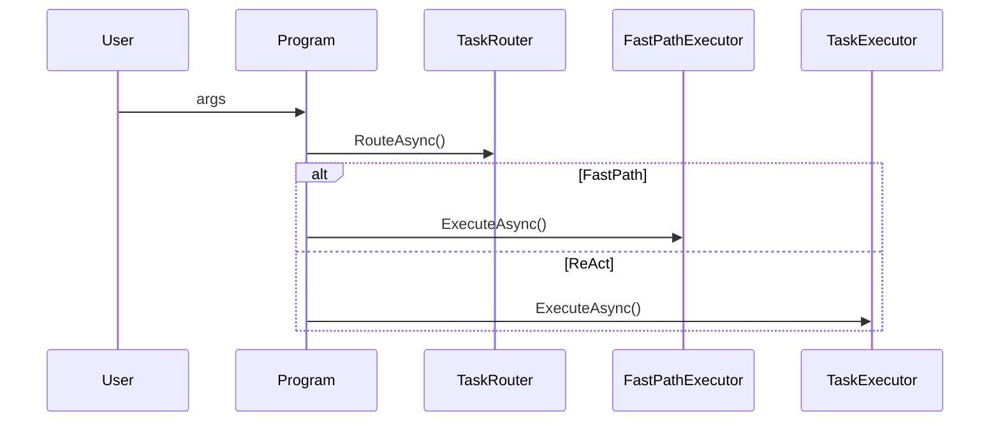

# P1 – Routing & Fast-Path Executor

## Overview
Route simple tasks to a low-latency path while forwarding complex tasks to the existing ReAct loop.

## New Components
| Component | Type | Responsibility |
|-----------|------|----------------|
| `ITaskRouter` | Interface | Classify incoming `TaskExecutionRequest`. |
| `TaskRouter` | Service | Few-shot LLM or rule-based classifier. |
| `IFastPathExecutor` | Interface | Execute “single-shot” tasks (one tool call or one LLM answer). |
| `FastPathExecutor` | Service | Bypasses ConversationManager; uses SimpleToolManager directly or a one-shot OpenAI call. |

## Interfaces
```csharp
public interface ITaskRouter
{
    Task<TaskRoute> RouteAsync(TaskExecutionRequest request);
}

public enum TaskRoute { FastPath, ReactLoop }
```

## Responsibilities
- **TaskRouter**: Analyzes incoming tasks and classifies them as suitable for fast-path execution or requiring the full ReAct loop.
- **FastPathExecutor**: Executes tasks that are determined to be simple or direct, using the most efficient method available.

## DI Registration
```csharp
services.AddSingleton<ITaskRouter, TaskRouter>();
services.AddSingleton<IFastPathExecutor, FastPathExecutor>();
```

## Execution Flow


## Testing Notes
- Mock `ITaskRouter` to force each route.
- Assert latency & token usage reductions.

---

## 1. Problem Statement
The current `SimpleTaskExecutor` always spins up the full ReAct loop, even for
trivial tasks (e.g. “What time is it?”) causing unnecessary latency and token
costs.  
We need a lightweight pre-router that decides whether a request can be handled
in a single shot (Fast-Path) or needs the full ReAct pipeline.

## 3. TaskRouter Design

The router relies on a **single lightweight LLM call** when rule certainty is
low; otherwise it delegates directly to Fast-Path or ReAct.

### 3.1 LLM Fallback  
If rule certainty is in the grey zone (`Score = 0.4-0.6`) call
`gpt-4.1-nano` with a compact few-shot prompt:
```
System: Classify if the user request can be answered in one LLM response or
        one tool call.
User   : <task>
Assistant (json): { "route": "FastPath" | "ReactLoop" }
```

### 3.2 API Contract
```csharp
public enum TaskRoute { FastPath, ReactLoop, Unknown }

public interface ITaskRouter
{
    Task<(TaskRoute route, double confidence)> RouteAsync(TaskExecutionRequest req,
                                                          CancellationToken ct = default);
}
```
`confidence` allows monitoring & gradual roll-out.

## 4. FastPathExecutor Design

### 4.1 Modes
| Mode | Trigger | Implementation |
|------|---------|----------------|
| **DirectTool** | Router marked “simple tool” | Call `SimpleToolManager.ExecuteToolAsync` directly. |
| **LLMOneShot** | Pure Q&A, no obvious tool | Call `ISessionAwareOpenAIService.CreateResponseAsync` with no ReAct prompt. |
| **NoOp** | Empty task / greeting | Return canned help text. |

### 4.2 Public Interface
```csharp
public interface IFastPathExecutor
{
    Task ExecuteAsync(TaskExecutionRequest req);
}
```

### 4.3 Result Handling
- Always write final answer to `ISessionActivityLogger` as `ActivityTypes.FastPathResult`.
- No session persistence (stateless) **unless** `req.SessionId` present –
  then append a single assistant message so history is retained.

## 5. Integration Points

| File | Change |
|------|--------|
| `Program.cs` | Inject `ITaskRouter` and `IFastPathExecutor`; branch before requesting `ITaskExecutor`. |
| `Extensions/ServiceCollectionExtensions.cs` | Register new services. |
| `SimpleTaskExecutor` | No change – only called if router picked `ReactLoop`. |
| `AgentConfiguration` | New flag `ENABLE_ROUTER` (default **false**) to gate feature. |

## 6. Sequence Diagram
...existing diagram unchanged...

## 7. Implementation Checklist

| # | Task | Files |
|---|------|-------|
| 1 | Add `TaskRoute` enum & `ITaskRouter` interface | `/Interfaces` |
| 2 | Implement `TaskRouter` (rule + optional LLM) | `/Services/TaskRouter.cs` |
| 3 | Add `IFastPathExecutor` & implementation | `/Services/FastPathExecutor.cs` |
| 4 | Extend `ServiceCollectionExtensions` for DI | `/Extensions/ServiceCollectionExtensions.cs` |
| 5 | Update `Program.Main` to use router | `/Program.cs` |
| 6 | Add env flag parsing (`ENABLE_ROUTER`) | `/Configuration/AgentConfiguration.cs` |
| 7 | Unit tests (xUnit) | `tests/TaskRouterTests.cs`, `FastPathExecutorTests.cs` |
| 8 | Persist routing stats inside session (`AgentSession.Metadata`) | `ConversationManager`, session layer |

## 8. Failure Handling & Fallbacks
- If Fast-Path fails (exception or confidence `<0.4`) log error and retry via
  ReAct automatically.
- Time-out guard: Fast-Path operations limited to 5 s.

## 10. Open Questions
- Should we write Fast-Path outputs to the same markdown document?
- Best structure for session-level routing statistics?
- Minimum tool set guarantee for DirectTool mode?