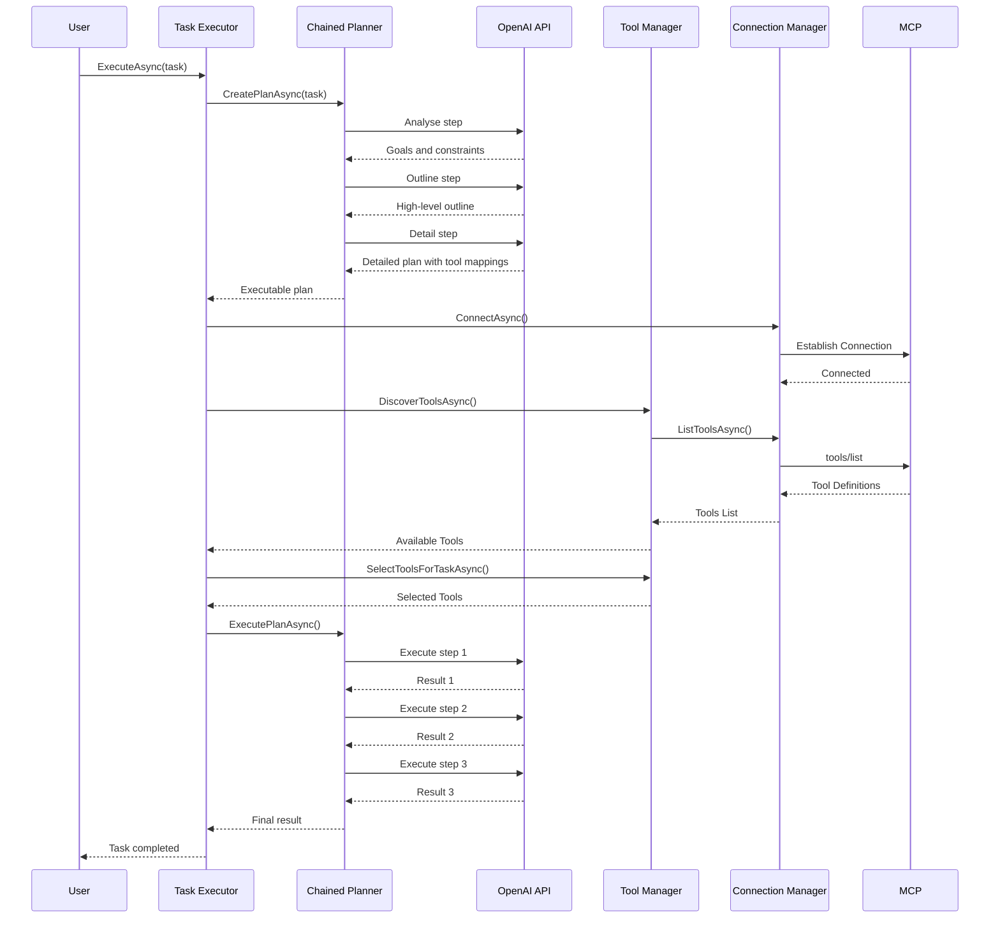
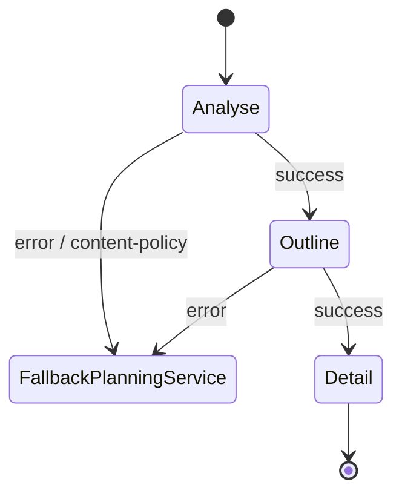

# P2 – Prompt-Chaining Planner

## Overview
Replace single PlanningService call with Analyse → Outline → Detail chain for higher quality plans.

## New Services
- `ChainedPlanner` implements `IPlanner` (new interface).  
- Uses three sequential `OpenAIResponsesService` calls with gates.

## Step Prompts
1. **Analyse** – extract goals, constraints, tool gaps.  
2. **Outline** – high-level step list.  
3. **Detail** – expand each step incl. tool mappings.

## Interaction
`TaskExecutor` asks `IPlanner.CreatePlanAsync()`.  
ChainedPlanner can fall back to existing PlanningService on error.

## Sequence Diagram


## Testing
- Unit tests per stage (mock OpenAI).  
- Integration test comparing plan quality score vs baseline.

## Migration
Register `IPlanner` with feature flag `USE_CHAINED_PLANNER=true`.

---

## 4. Goals & Non-Goals
| Goals | Non-Goals |
|-------|-----------|
| Increase plan quality and determinism | Replace existing `PlanningService` entirely (kept for fallback) |
| Keep latency within 2× current single-shot call | Rewrite core ReAct loop |
| Provide structured JSON outputs for each stage | Introduce external dependencies beyond OpenAI |

## 5. Current Baseline
- `PlanningService.CreatePlanAsync()` is a single OpenAI call.
- Registered in DI as `PlanningService` **only** – no abstraction.
- Called exclusively from `TaskExecutor`.

## 6. Proposed Components
| File / Class | Purpose |
|--------------|---------|
| `Interfaces/IPlanner.cs` | Abstracts any planner implementation |
| `Services/ChainedPlanner.cs` | Implements Analyse → Outline → Detail chain |
| `Services/PlanningService.cs` | Retained; implements `IPlanner` (single-shot) |
| `Extensions/ServiceCollectionExtensions.cs` | Registers `IPlanner` (factory chooses impl) |

### Interface
```csharp
public interface IPlanner
{
    Task<string> CreatePlanAsync(
        string task,
        IList<string>? availableTools = null,
        string? sessionId = null);
}
```

### Registration Logic
```csharp
services.AddSingleton<IPlanner>(sp =>
{
    var cfg = sp.GetRequiredService<AgentConfiguration>();
    return cfg.UseChainedPlanner
        ? sp.GetRequiredService<ChainedPlanner>()
        : sp.GetRequiredService<PlanningService>();
});
```

## 7. Prompt Chain
1. **Analyse**  
   ```jsonc
   {
     "task": "<plain task>",
     "goals": [],
     "constraints": [],
     "unknowns": [],
     "tool_gaps": []
   }
   ```
2. **Outline**  
   Takes `Analyse` JSON → returns ordered `steps[]` with brief titles.
3. **Detail**  
   Expands each step to:
   ```jsonc
   {
     "step": "<title>",
     "description": "<detailed>",
     "tools": ["tool_a", "tool_b"],
     "success": "<criteria>"
   }
   ```

## 8. Data-Flow & Fallback


## 9. Configuration
| Env Var | Default | Description |
|---------|---------|-------------|
| `USE_CHAINED_PLANNER` | `false` | Switch implementation |
| `CHAINED_PLANNER_MODEL` | `gpt-4.1-nano` | Cheap reasoning model for Analyse / Outline |
| `CHAINED_PLANNER_DETAIL_MODEL` | `gpt-4.1` | Higher-quality model for Detail stage |
| `CHAINED_PLANNER_MAX_TOKENS` | `2048` | Safety guard per call |

`AgentConfiguration` ‑ add:
```csharp
public bool UseChainedPlanner { get; set; }
public ChainedPlannerConfig ChainedPlanner { get; set; } = new();
```

## 10. Telemetry & Metrics
- Emit `ActivityTypes.PlannerStage` with `Stage`, `Model`, `LatencyMs`, `InputTokens`, `OutputTokens`.
- Log truncated prompts/results respecting `ActivityLogging.MaxStringSize`.

## 11. Error Handling
| Failure Point | Action |
|---------------|--------|
| OpenAI error / exception | Log `FailActivity`, fall back to `PlanningService` |
| Invalid JSON from stage | Retry once; else fall back |
| Total chain latency > 2× single-shot average | Emit warning metric |

## 12. Unit Tests
1. `ChainedPlannerTests.Analyse_ReturnsGoalsConstraints()`
2. `ChainedPlannerTests.Outline_UsesAnalyseOutput()`
3. `ChainedPlannerTests.Detail_ProducesToolMappings()`
4. `PlannerFactoryTests_HonoursFlag()`

Use mocked `IOpenAIResponsesService` returning canned messages.

## 13. Migration Checklist
- [x] Add `IPlanner` interface.
- [x] Move existing `PlanningService` under `Services` and implement `IPlanner`.
- [x] Create `ChainedPlanner.cs`.
- [x] Extend `AgentConfiguration` + env parsing.
- [x] Register new services in `ServiceCollectionExtensions`.
- [x] Inject `IPlanner` into `TaskExecutor`.
- [x] Update docs & README.
- [x] Add tests & ensure CI passes.

## 14. Timeline
| Day | Task |
|-----|------|
| 1 | Interface + config scaffolding |
| 2 | Implement Analyse & Outline |
| 3 | Implement Detail + end-to-end integration |
| 4 | Telemetry, fallback logic, tests |
| 5 | Documentation + PR review |