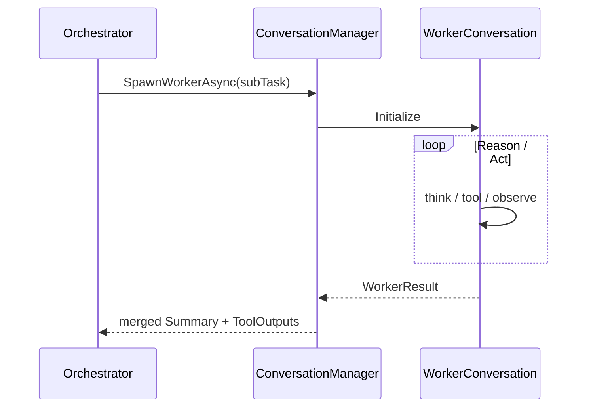

# P5 – Worker Sub-Conversations

## Purpose
Allow main ConversationManager to spawn isolated sub-conversations for task segments and merge results.

## Additions
- `SpawnWorkerAsync(string subTask)` on `IConversationManager`.
- `WorkerConversation` (lightweight CM without markdown tracking).
- Aggregation strategy: parent receives summary + tool results.

## Lifecycle
```mermaid
graph LR
Parent -->|Spawn| Worker1 & Worker2
Worker1 -->|Summary| Parent
Worker2 -->|Summary| Parent
Parent -->|Synthesise| Continue main loop
```

## Session Handling
Workers write to same session table with `ParentId`.

## Testing
- Simulate parallel sub-tasks, verify summaries concatenated.

---

## Design Objectives
1. Follow the global guidelines from `agentalpha-patterns-design.md` (router always on, metrics captured in-session, default model `gpt-4.1-nano` where possible).  
2. Keep **ConversationManager** backward-compatible; spawning workers must be optional and cheap for simple tasks.  
3. Constrain token usage by limiting worker depth to **one level** (workers may not spawn grandchildren).  
4. Provide deterministic aggregation so the orchestrator can reproduce results for audit / retry.

## Proposed Interfaces
### IConversationManager
```csharp
Task<WorkerResult> SpawnWorkerAsync(string subTask,
                                    AgentSession parentSession,
                                    CancellationToken ct = default);
```
Notes:  
• Re-uses parent `AgentSession` but tags all messages with `ParentId = parentSession.Id`.  
• Returns a **WorkerResult** containing `Summary`, `ToolOutputs`, `TokensUsed`.

### WorkerConversation (new class)
Lightweight wrapper around **ConversationManager**:  
• No markdown transcript writing.  
• Minimal memory window (configurable, default 16 messages).  
• Obeys a `MaxReasoningSteps` injected policy (default 4).  
• **Model selection:** picks `FastModel` (`gpt-4.1-nano`) for short sub-tasks and falls back to
  `Model` (`gpt-4.1`) for longer reasoning. These values inherit from
  `AgentConfiguration` but can be overridden per-worker.

### WorkerResult (record)
```csharp
public sealed record WorkerResult(string Summary,
                                  IReadOnlyList<ToolInvocation> ToolOutputs,
                                  UsageStats TokensUsed);
```

## Execution Flow


## Aggregation Strategy
1. Parent inserts each `WorkerResult.Summary` into its scratchpad under `## Worker n Summary`.  
2. `ToolOutputs` are merged into the running list before the next planning cycle.  
3. Metrics (`TokensUsed`) are added to `Session.Metadata.WorkerStats` for reporting.

## Error Handling & Retry
• Worker timeout or failure ⇒ return synthetic summary: “Worker timed-out after N steps.”  
• Parent may re-queue a failed sub-task **once**; subsequent failures propagate to orchestrator.

## Metrics & Tracing
| Metric | Captured In | Notes |
|--------|-------------|-------|
| `worker.count` | `Session.Metadata.WorkerStats.Total` | Total workers spawned |
| `worker.avgTokens` | `WorkerStats` | Cost overview |
| `worker.failures` | `WorkerStats` | Non-successful runs |

## Implementation Plan
1. Add `WorkerResult` model in **`src/Agent/AgentAlpha/Models`** so it is
   available to both `ConversationManager` and `SimpleTaskExecutor`.
2. Extend `IConversationManager` with  
   `Task<WorkerResult> SpawnWorkerAsync(string subTask, AgentSession session, CancellationToken ct = default);`
   and implement the default logic in `ConversationManager`.
3. Create `WorkerConversation` in `src/Agent/AgentAlpha/Services/WorkerConversation.cs`
   (inherits most helpers from `ConversationManager`, turns off markdown and
   trims `MaxConversationMessages` to 16).
4. Wire DI:
   - `services.AddSingleton<WorkerConversation>();`
   - no extra feature flag – workers are **always available**; orchestration
     decides when to use them.
5. Update **`SimpleTaskExecutor`** (not `TaskExecutor`) to:
   - Detect **sub-tasks** (simple heuristic for now).
   - Spawn workers **sequentially** (parallelism is deferred until P4).
   - Aggregate `WorkerResult` summaries into its current scratch-markdown via
     `ConversationManager.UpdateMarkdownAsync()`.
6. Tests (`tests/AgentAlpha.Tests/P5`):
   • `ConversationManager_SpawnWorker_ReturnsSummary()`  
   • `SimpleTaskExecutor_AggregatesWorkerSummaries()`  

## Checklist
- [x] `WorkerResult` model created in `src/Agent/AgentAlpha/Models`
- [x] `IConversationManager` exposes `SpawnWorkerAsync`
- [x] `WorkerConversation` implemented with trimmed context window
- [x] DI registered: `services.AddSingleton<WorkerConversation>()`
- [x] `SimpleTaskExecutor` spawns and aggregates workers sequentially    <!-- updated -->
- [x] New unit tests green (`ConversationManager`, `SimpleTaskExecutor`)
- [x] `worker.*` metrics captured in `Session.Metadata`                 <!-- updated -->
- [x] Docs & diagrams updated accordingly

## Known Issues / Open Items
- **Message depth**: current `ConversationManager` optimisation trims only
  top-level conversation; spawning workers increases total token count. We may
  need a global `MaxWorkerTokens` guard – to be revisited during P5 coding.
- **Tool context leakage**: parent tools list is passed verbatim to workers;
  filtering might be required for security in future releases.

