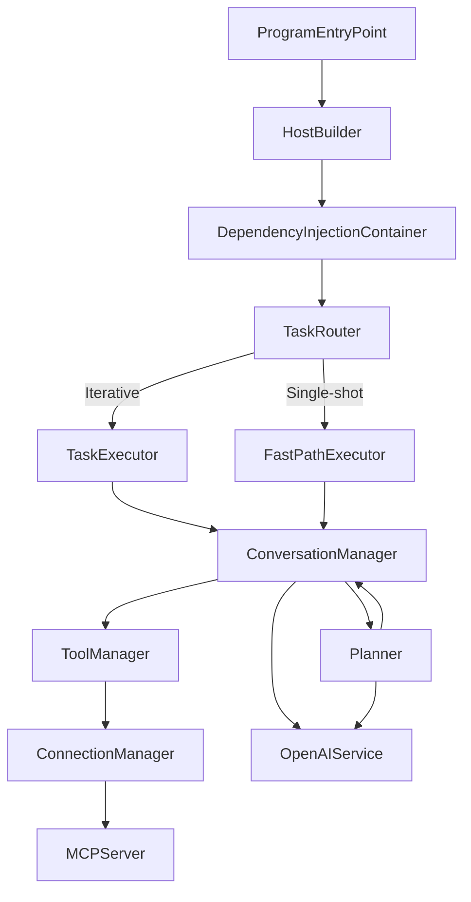
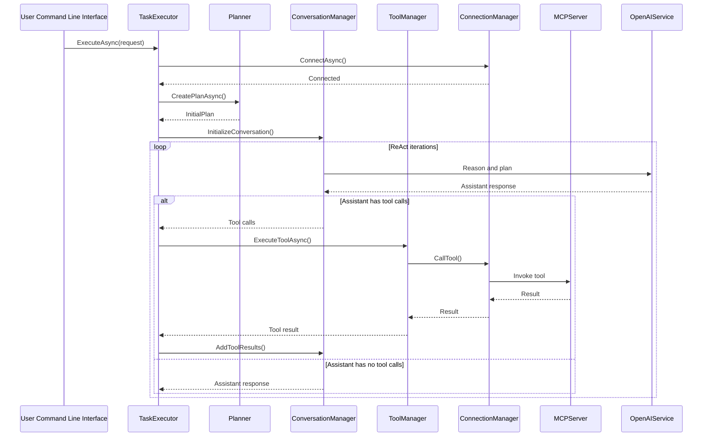
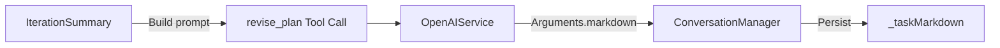

# AgentAlpha – High-Level Architecture

AgentAlpha is a modular AI agent that combines OpenAI LLM reasoning with Model-Context-Protocol (MCP) tool execution.  
The system is built around dependency injection, clear separation of concerns, and pluggable planners.

---

## Overview

1. **Program Entry Point** – Parses command-line arguments, loads configuration and builds the host.
2. **Host / Dependency Injection Container** – Registers every service and provides them at runtime.
3. **Task Router** – Decides whether the request is handled through the fast path or the full ReAct executor.
4. **Executors**  
   • **Fast Path Executor** – Single-shot tasks with minimal context.  
   • **Task Executor (ReAct)** – Iterative reasoning, action, observation loop.
5. **Conversation Manager** – Maintains the OpenAI conversation, markdown task state, and worker agents.
6. **Tooling Layer**  
   • **Tool Manager** – Discovers, filters and invokes tools available via MCP.  
   • **Connection Manager** – Manages the physical connection to the MCP server.
7. **External Services** – OpenAI API for LLM calls and the MCP Server for tool execution.

---

## Mermaid Diagram

---

## Key Design Principles

- **Single Responsibility** – Each class has one clear purpose.  
- **Dependency Injection** – All services are resolved through the container.  
- **Interface Segregation** – Small, focused contracts for testability.  
- **Configuration via Environment Variables** – No hard-coded secrets or paths.  
- **Resilience and Observability** – Rich activity logging and graceful error handling.

---

## Main Data Flow

1. A task enters through the command line.  
2. The **Task Router** selects an executor.  
3. The executor delegates reasoning to the **Conversation Manager** which in turn:  
   - Consults the **Planner** (single or chained) for plan creation or refinement.  
   - Calls the **OpenAI Service** for language reasoning.  
   - Invokes the **Tool Manager** for concrete actions.  
4. The **Tool Manager** communicates with the **MCP Server** via the **Connection Manager**.  
5. Results and observations are fed back into the conversation until completion.

---

*Last updated: {{DATE}}*

---

## Task Executor in Depth

`SimpleTaskExecutor` is the main orchestrator for the ReAct execution path.

### Responsibilities  
- Establish connection to **ModelContextProtocol Server** via `ConnectionManager`.  
- Create / resume a **Session** and notify the `SessionActivityLogger`.  
- Discover, filter and execute **Tools** through `SimpleToolManager`.  
- Generate an execution **Plan** (`IPlanner`) and refine it (`PlanRefinementLoop`).  
- Drive the **ReAct** conversation loop and decide completion.

### Key Methods  
| Method | Purpose |
|--------|---------|
| `ExecuteAsync(TaskExecutionRequest)` | Entry point, sets up everything. |
| `ConnectToMcpServerAsync()` | Chooses HTTP / STDIO transport and connects. |
| `GetOrCreateSessionAsync()` | Ensures a session entity exists. |
| `SetupConversationAsync()` | Starts or resumes `ConversationManager`. |
| `ExecuteConversationLoopAsync()` | Runs up to *N* ReAct iterations (reason → act → observe). |

### Sequence Diagram

---

## Conversation Manager in Depth

`ConversationManager` encapsulates all interaction with the OpenAI API and keeps the running context.

### Internals  
- **Message Buffer** `List<object>` – stores system / user / assistant exchanges.  
- **Markdown State** – `_taskMarkdown` updated every iteration via the hidden *revise_plan* tool.  
- **Recent Responses** – `_recentAssistantResponses` for repetition detection.  
- **Activity Logging** – wraps every OpenAI request / response with `ISessionActivityLogger`.

### Important Methods  
| Method | Purpose |
|--------|---------|
| `ProcessIterationAsync()` | Builds request, adds trimmed markdown context, parses tool calls. |
| `AddToolResults()` | Injects observation data and prompt for next reasoning step. |
| `UpdateMarkdownAsync()` | Calls OpenAI with the hidden *revise_plan* function to keep markdown in sync. |
| `IsTaskComplete()` | Detects completion via tool call or heuristic phrases. |
| `OptimizeConversationLength()` | Enforces `MaxConversationMessages` by trimming old messages. |
| `SpawnWorkerAsync()` | Creates a light-weight `WorkerConversation` for sub-tasks (P5 feature). |

### Markdown Update Cycle

The hidden **revise_plan** function ensures the markdown always mirrors the latest reasoning, actions and observations and can propose next tools to execute.

### Anti-Stuck Mechanisms  
1. **Repetition Guard** – compares the last 3 assistant messages and warns if ≥ 80 % identical.  
2. **Conversation Trimming** – keeps total messages ≤ configured limit while preserving system prompts.  
3. **Natural Language Completion Detection** – multiple heuristics to exit loops even if the agent forgets to call `complete_task`.

---
