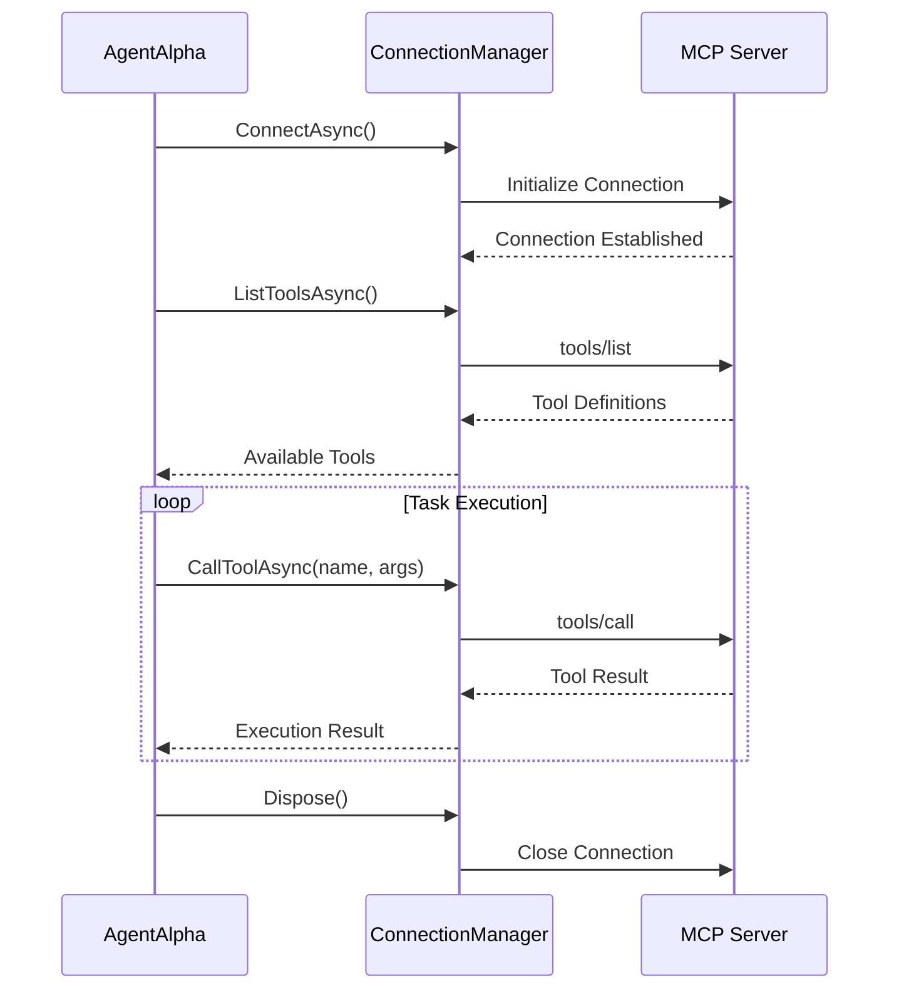
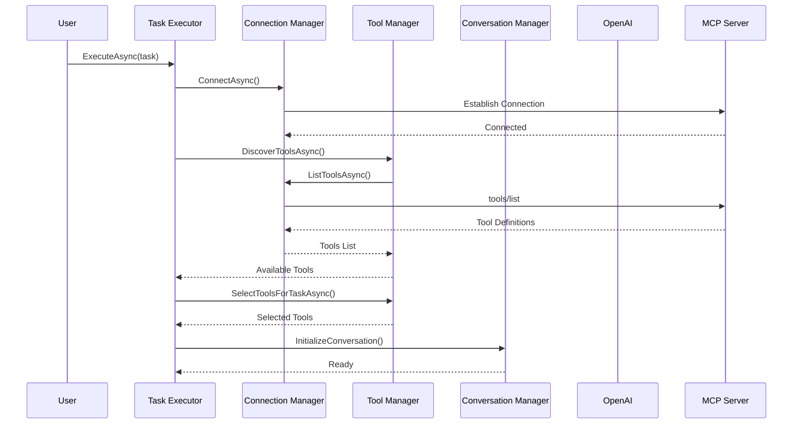
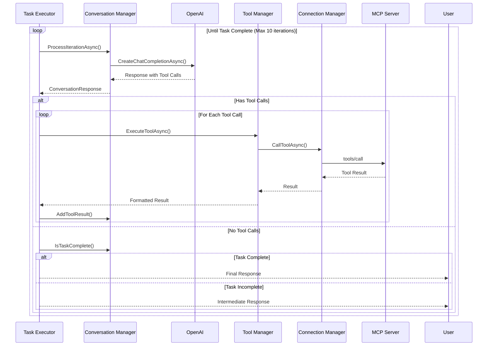
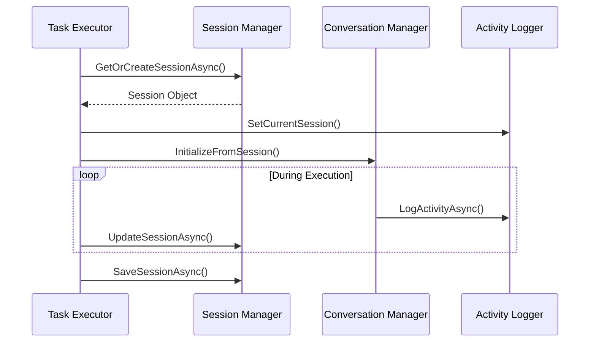

# AgentAlpha Design Document

**How an AI Agent Solves Tasks Using LLMs and MCP Client+Server with Tools**

## Table of Contents

1. [Executive Summary](#executive-summary)
2. [Core Design Principles](#core-design-principles)
3. [System Architecture](#system-architecture)
4. [Task-Solving Methodology](#task-solving-methodology)
5. [MCP Client+Server Integration](#mcp-clientserver-integration)
6. [Component Interactions](#component-interactions)
7. [Task Execution Lifecycle](#task-execution-lifecycle)
8. [Examples and Use Cases](#examples-and-use-cases)
9. [Configuration and Extensibility](#configuration-and-extensibility)
10. [Future Considerations](#future-considerations)

---

## Executive Summary

AgentAlpha is an AI agent that implements the **ReAct (Reasoning and Acting) pattern** to solve complex tasks by combining Large Language Model (LLM) reasoning with tool execution through the Model Context Protocol (MCP). The agent follows a conversational loop where it reasons about problems, selects appropriate tools, executes actions, and iterates until task completion.

### Key Capabilities
- **LLM-Powered Reasoning**: Uses OpenAI GPT models for task analysis and planning
- **Tool Integration**: Connects to MCP servers to access diverse tool ecosystems
- **Session Management**: Maintains conversation context across multiple interactions
- **Dynamic Tool Discovery**: Automatically discovers and adapts to available tools
- **Error Recovery**: Handles tool failures gracefully and adjusts approach

### Design Goals
- **Modularity**: Clean separation of concerns across components
- **Extensibility**: Easy integration of new tools and capabilities
- **Reliability**: Robust error handling and recovery mechanisms
- **Scalability**: Efficient resource usage and session management

---

## Core Design Principles

### 1. Separation of Concerns
Each component has a single, well-defined responsibility:
- **Task Execution**: Orchestrates the overall task-solving process
- **Connection Management**: Handles MCP server lifecycle and communication
- **Tool Management**: Discovers, filters, and executes tools
- **Conversation Management**: Manages LLM interactions and message flow

### 2. Protocol-Driven Integration
The Model Context Protocol serves as the foundation for tool integration:
- **Standardized Interface**: Consistent API across all tool providers
- **Language Agnostic**: Tools can be implemented in any language
- **Transport Flexibility**: Supports stdio and HTTP communication
- **Extensible Schema**: JSON schema-based tool definitions

### 3. Conversational AI Pattern
Following the ReAct methodology:
- **Reasoning**: LLM analyzes the task and plans approach
- **Acting**: Agent executes selected tools with appropriate parameters
- **Observation**: Results are incorporated into the conversation context
- **Iteration**: Process repeats until task completion

### 4. Configuration-Driven Behavior
Agent behavior is controlled through configuration:
- **Tool Filtering**: Whitelist/blacklist specific tools
- **Model Selection**: Choose appropriate LLM for the task
- **Session Management**: Control conversation length and persistence
- **Transport Options**: Configure MCP connection methods

---

## System Architecture

### High-Level Component Overview

```
┌─────────────────────────────────────────────────────────────────┐
│                        AgentAlpha                               │
├─────────────────────────────────────────────────────────────────┤
│  ┌─────────────────┐    ┌─────────────────┐    ┌──────────────┐ │
│  │   Task Executor │    │ Conversation    │    │ Tool Manager │ │
│  │                 │◄──►│ Manager         │◄──►│              │ │
│  │ - Orchestration │    │ - LLM Interface │    │ - Discovery  │ │
│  │ - Session Mgmt  │    │ - Message Flow  │    │ - Filtering  │ │
│  │ - Error Recovery│    │ - State Tracking│    │ - Execution  │ │
│  └─────────────────┘    └─────────────────┘    └──────────────┘ │
│           │                       │                       │     │
│  ┌─────────────────┐              │              ┌──────────────┐ │
│  │ Connection Mgr  │              │              │ Session      │ │
│  │                 │              │              │ Management   │ │
│  │ - MCP Protocol  │              │              │              │ │
│  │ - Transport     │              │              │ - Persistence│ │
│  │ - Lifecycle     │              │              │ - History    │ │
│  └─────────────────┘              │              └──────────────┘ │
└────────────────────────────────────┼─────────────────────────────┘
                                     │
        ┌────────────────────────────┼────────────────────────────┐
        │                            │                            │
        │         OpenAI API         │         MCP Server         │
        │                            │                            │
        │ ┌─────────────────────────┐ │ ┌─────────────────────────┐│
        │ │      GPT Models         │ │ │      Tool Ecosystem     ││
        │ │                         │ │ │                         ││
        │ │ - Text Generation       │ │ │ - Mathematical Tools    ││
        │ │ - Function Calling      │ │ │ - File Operations       ││
        │ │ - Tool Schema Support   │ │ │ - Web Search           ││
        │ │ - Context Management    │ │ │ - System Commands       ││
        │ └─────────────────────────┘ │ │ - Custom Extensions     ││
        │                             │ └─────────────────────────┘│
        └─────────────────────────────┴─────────────────────────────┘
```

### Component Relationships

#### ITaskExecutor
- **Primary Role**: Main orchestrator that coordinates all other components
- **Responsibilities**:
  - Initializes MCP connections
  - Sets up conversation context
  - Manages the ReAct execution loop
  - Handles session persistence
  - Provides error recovery and timeout handling

#### IConversationManager
- **Primary Role**: Manages interactions with the LLM
- **Responsibilities**:
  - Maintains conversation history
  - Formats messages for OpenAI API
  - Processes LLM responses and extracts tool calls
  - Manages conversation flow and state

#### IToolManager
- **Primary Role**: Handles all tool-related operations
- **Responsibilities**:
  - Discovers available tools from MCP servers
  - Applies filtering based on configuration
  - Converts MCP tool schemas to OpenAI format
  - Executes tool calls and processes results

#### IConnectionManager
- **Primary Role**: Manages MCP server connections
- **Responsibilities**:
  - Establishes and maintains MCP connections
  - Handles transport protocols (stdio/HTTP)
  - Provides interface for tool discovery and execution
  - Manages connection lifecycle and error recovery

---

## Task-Solving Methodology

### The ReAct Pattern Implementation

AgentAlpha implements the ReAct (Reasoning and Acting) pattern, which alternates between reasoning about a problem and taking actions to solve it.

#### 1. Reasoning Phase
```
User Task: "Calculate the square root of 144 and then find all its factors"

LLM Reasoning:
"I need to:
1. Calculate the square root of 144
2. Find all factors of that result
Let me start with the square root calculation."
```

#### 2. Action Phase
```
Tool Selection: calculate
Parameters: {"expression": "sqrt(144)"}
Execution: Returns "12"
```

#### 3. Observation Phase
```
Result Integration:
"The square root of 144 is 12. Now I need to find all factors of 12."
```

#### 4. Iteration Phase
```
Next Action: calculate
Parameters: {"expression": "factors(12)"}
Execution: Returns "[1, 2, 3, 4, 6, 12]"

Final Response:
"The square root of 144 is 12, and its factors are: 1, 2, 3, 4, 6, 12"
```

### Task Decomposition Strategy

The agent employs several strategies for breaking down complex tasks:

#### Hierarchical Decomposition
- **Complex Task**: Analyze market trends and create investment recommendations
- **Sub-tasks**: 
  1. Gather current market data
  2. Analyze historical trends
  3. Identify key indicators
  4. Generate recommendations
  5. Format results

#### Sequential Execution
- Tasks that depend on previous results
- Each step builds upon the output of the previous step
- Error handling at each stage prevents cascading failures

#### Parallel Opportunities
- Independent sub-tasks can be identified
- Multiple tool calls can be planned simultaneously
- Results are consolidated in the reasoning phase

### Adaptive Planning

The agent adapts its approach based on:

#### Available Tools
```csharp
// Agent discovers MCP tools and adjusts strategy
var availableTools = await toolManager.DiscoverToolsAsync(connection);
var selectedTools = await toolManager.SelectToolsForTaskAsync(task, availableTools);

// Strategy changes based on tool availability
if (selectedTools.Any(t => t.Name == "web_search"))
{
    // Can access current information
    strategy = StrategyType.WebEnhanced;
}
else
{
    // Limited to computational tools
    strategy = StrategyType.Computational;
}
```

#### Task Complexity
- Simple tasks: Direct tool execution
- Complex tasks: Multi-step decomposition
- Unknown tasks: Exploratory approach with tool discovery

#### Error Conditions
- Tool failures trigger alternative approaches
- Network issues initiate retry mechanisms
- Invalid inputs prompt clarification requests

---

## MCP Client+Server Integration

### Model Context Protocol Overview

The Model Context Protocol enables standardized communication between AI agents and tool providers:

```
Agent (MCP Client) ←→ MCP Protocol ←→ Tool Provider (MCP Server)
```

### Protocol Benefits

#### Standardization
- **Consistent API**: All tools expose the same interface
- **Schema-Driven**: JSON schemas define tool capabilities
- **Version Management**: Protocol supports evolution and compatibility

#### Flexibility
- **Transport Agnostic**: Works over stdio, HTTP, WebSockets
- **Language Independent**: Tools can be implemented in any language
- **Platform Neutral**: Runs on various operating systems

#### Extensibility
- **Dynamic Discovery**: Tools can be added without agent changes
- **Custom Tools**: Organizations can create proprietary tools
- **Community Tools**: Shared tool ecosystem development

### Connection Lifecycle



### Tool Discovery and Selection

#### Discovery Process
```csharp
public async Task<IList<McpClientTool>> DiscoverToolsAsync(IConnectionManager connection)
{
    if (!connection.IsConnected)
    {
        _logger.LogWarning("Connection is not active, cannot discover tools");
        return new List<McpClientTool>();
    }

    try
    {
        var tools = await connection.ListToolsAsync();
        _logger.LogDebug("Discovered {Count} tools from MCP server", tools.Count);
        return tools;
    }
    catch (Exception ex)
    {
        _logger.LogError(ex, "Failed to discover tools from MCP server");
        return new List<McpClientTool>();
    }
}
```

#### Selection Strategy
```csharp
public Task<ToolDefinition[]> SelectToolsForTaskAsync(
    string task, 
    IList<McpClientTool> availableTools, 
    int maxTools = 10)
{
    // Analyze task requirements
    var taskKeywords = ExtractKeywords(task);
    
    // Score tools based on relevance
    var scoredTools = availableTools
        .Select(tool => new { 
            Tool = tool, 
            Score = CalculateRelevanceScore(tool, taskKeywords) 
        })
        .OrderByDescending(x => x.Score)
        .Take(maxTools)
        .Select(x => CreateOpenAiToolDefinition(x.Tool))
        .ToArray();
    
    return Task.FromResult(scoredTools);
}
```

### Tool Execution Flow

#### OpenAI Integration
```csharp
// Tools are provided to OpenAI as function definitions
var request = new ChatCompletionRequest
{
    Model = _config.Model,
    Messages = _messages.ToArray(),
    Tools = selectedTools,  // MCP tools converted to OpenAI format
    ToolChoice = "auto"
};

var response = await _openAi.CreateChatCompletionAsync(request);
```

#### MCP Tool Execution
```csharp
// OpenAI response contains tool calls that are executed via MCP
foreach (var toolCall in response.ToolCalls)
{
    var result = await _connectionManager.CallToolAsync(
        toolCall.Name, 
        toolCall.Arguments);
    
    // Results are fed back into the conversation
    _messages.Add(new ToolResultMessage(toolCall.Id, result));
}
```

### Error Handling and Resilience

#### Connection Failures
- Automatic retry with exponential backoff
- Fallback to local tools when available
- Graceful degradation of capabilities

#### Tool Execution Errors
- Error context preserved in conversation
- Alternative tool selection when available
- User notification for unrecoverable errors

#### Protocol Compatibility
- Version negotiation during connection
- Feature detection and adaptation
- Backward compatibility maintenance

---

## Component Interactions

### Initialization Sequence



### Execution Loop



### Session Management Integration



### Error Propagation

```csharp
// Error handling flows through the component hierarchy
public async Task ExecuteAsync(TaskExecutionRequest request)
{
    try
    {
        await ConnectToMcpServerAsync();
        await ExecuteConversationLoopAsync(request.Task);
    }
    catch (ConnectionException ex)
    {
        _logger.LogError(ex, "MCP connection failed");
        await HandleConnectionFailure(ex);
    }
    catch (ToolExecutionException ex)
    {
        _logger.LogError(ex, "Tool execution failed");
        await HandleToolFailure(ex);
    }
    catch (OpenAIException ex)
    {
        _logger.LogError(ex, "OpenAI API error");
        await HandleOpenAIFailure(ex);
    }
}
```

---

## Task Execution Lifecycle

### Phase 1: Initialization

#### Connection Setup
```csharp
private async Task ConnectToMcpServerAsync()
{
    _logger.LogInformation("Connecting to MCP server: {ServerName}", _config.ServerName);
    
    await _connectionManager.ConnectAsync(
        _config.Transport,
        _config.ServerName,
        _config.ServerUrl,
        _config.Command,
        _config.Args);
    
    if (!_connectionManager.IsConnected)
    {
        throw new InvalidOperationException("Failed to establish MCP connection");
    }
    
    _logger.LogInformation("Successfully connected to MCP server");
}
```

#### Session Management
```csharp
private async Task<AgentSession> GetOrCreateSessionAsync(
    TaskExecutionRequest request, 
    string sessionName)
{
    if (!string.IsNullOrEmpty(request.SessionId))
    {
        // Resume existing session
        var existingSession = await _sessionManager.GetSessionAsync(request.SessionId);
        if (existingSession != null)
        {
            _logger.LogInformation("Resuming session: {SessionId}", request.SessionId);
            return existingSession;
        }
    }
    
    // Create new session
    var newSession = new AgentSession
    {
        Id = Guid.NewGuid().ToString(),
        Name = sessionName,
        Status = SessionStatus.Active,
        CreatedAt = DateTime.UtcNow,
        UpdatedAt = DateTime.UtcNow
    };
    
    await _sessionManager.CreateSessionAsync(newSession);
    _logger.LogInformation("Created new session: {SessionName}", sessionName);
    return newSession;
}
```

#### Tool Discovery and Selection
```csharp
private async Task<ToolDefinition[]> PrepareToolsAsync(string task)
{
    // Discover all available tools
    var availableTools = await _toolManager.DiscoverToolsAsync(_connectionManager);
    
    // Apply configuration filters
    var filteredTools = _toolManager.ApplyFilters(availableTools, _config.ToolFilter);
    
    // Select most relevant tools for the task
    var selectedTools = await _toolManager.SelectToolsForTaskAsync(task, filteredTools);
    
    _logger.LogInformation("Selected {Count} tools for task execution", selectedTools.Length);
    return selectedTools;
}
```

### Phase 2: Conversation Loop

#### Main Execution Loop
```csharp
private async Task ExecuteConversationLoopAsync(string task)
{
    const int maxIterations = 10;
    var iteration = 0;
    
    // Prepare tools for the task
    var selectedTools = await PrepareToolsAsync(task);
    
    _logger.LogInformation("Starting conversation loop with {ToolCount} tools", selectedTools.Length);
    
    while (iteration < maxIterations)
    {
        iteration++;
        _logger.LogDebug("Conversation iteration {Iteration}", iteration);
        
        // Get LLM response
        var response = await _conversationManager.ProcessIterationAsync(selectedTools);
        
        if (!response.HasToolCalls)
        {
            // Check if task is complete
            if (_conversationManager.IsTaskComplete(response.AssistantText))
            {
                _logger.LogInformation("Task completed after {Iterations} iterations", iteration);
                break;
            }
            else
            {
                _logger.LogInformation("Assistant responded without tool calls");
                break;
            }
        }
        
        // Execute tool calls
        await ExecuteToolCallsAsync(response.ToolCalls);
    }
    
    if (iteration >= maxIterations)
    {
        _logger.LogWarning("Task execution reached maximum iterations ({MaxIterations})", maxIterations);
    }
}
```

#### Tool Execution
```csharp
private async Task ExecuteToolCallsAsync(IReadOnlyList<ToolCall> toolCalls)
{
    var toolResults = new List<string>();
    
    foreach (var toolCall in toolCalls)
    {
        try
        {
            _logger.LogDebug("Executing tool: {ToolName}", toolCall.Name);
            
            var result = await _toolManager.ExecuteToolAsync(
                _connectionManager, 
                toolCall.Name, 
                toolCall.Arguments);
            
            toolResults.Add($"[{toolCall.Name}] {result}");
            
            _logger.LogDebug("Tool execution successful: {ToolName}", toolCall.Name);
        }
        catch (Exception ex)
        {
            _logger.LogError(ex, "Tool execution failed for {ToolName}", toolCall.Name);
            toolResults.Add($"[{toolCall.Name}] Error: {ex.Message}");
        }
    }
    
    // Add tool results to conversation
    var combinedResults = string.Join("\n", toolResults);
    await _conversationManager.AddToolResultsAsync(combinedResults);
}
```

### Phase 3: Completion and Cleanup

#### Session Persistence
```csharp
private async Task SaveSessionStateAsync(AgentSession session)
{
    // Update session with final state
    session.Status = SessionStatus.Completed;
    session.UpdatedAt = DateTime.UtcNow;
    session.ConversationHistory = _conversationManager.GetConversationHistory();
    
    await _sessionManager.UpdateSessionAsync(session);
    _logger.LogInformation("Session state saved: {SessionId}", session.Id);
}
```

#### Resource Cleanup
```csharp
public async ValueTask DisposeAsync()
{
    try
    {
        if (_connectionManager != null)
        {
            await _connectionManager.DisposeAsync();
        }
        
        _logger.LogInformation("TaskExecutor disposed successfully");
    }
    catch (Exception ex)
    {
        _logger.LogError(ex, "Error during TaskExecutor disposal");
    }
}
```

### Error Recovery Strategies

#### Retry Logic
```csharp
private async Task<T> ExecuteWithRetryAsync<T>(
    Func<Task<T>> operation,
    int maxRetries = 3,
    TimeSpan delay = default)
{
    var attempts = 0;
    Exception lastException = null;
    
    while (attempts < maxRetries)
    {
        try
        {
            return await operation();
        }
        catch (Exception ex) when (IsRetriableException(ex))
        {
            lastException = ex;
            attempts++;
            
            if (attempts < maxRetries)
            {
                _logger.LogWarning(ex, "Operation failed, retrying in {Delay}ms (attempt {Attempt}/{MaxRetries})", 
                    delay.TotalMilliseconds, attempts, maxRetries);
                
                if (delay > TimeSpan.Zero)
                {
                    await Task.Delay(delay);
                }
            }
        }
    }
    
    throw lastException ?? new InvalidOperationException("Operation failed after all retry attempts");
}
```

#### Graceful Degradation
```csharp
private async Task<ConversationResponse> HandleToolFailureAsync(
    string originalTask,
    Exception toolException)
{
    _logger.LogWarning(toolException, "Tool execution failed, attempting alternative approach");
    
    // Try alternative tools
    var alternativeTools = await FindAlternativeToolsAsync(originalTask);
    if (alternativeTools.Any())
    {
        return await _conversationManager.ProcessWithAlternativeToolsAsync(alternativeTools);
    }
    
    // Fall back to pure reasoning
    _logger.LogInformation("No alternative tools available, falling back to reasoning-only mode");
    return await _conversationManager.ProcessWithoutToolsAsync();
}
```

---

## Examples and Use Cases

### Example 1: Mathematical Problem Solving

#### User Request
```
"Calculate the compound interest on $1000 invested at 5% annual interest rate for 3 years, compounded quarterly."
```

#### Agent Execution Flow

**Step 1: Task Analysis**
```
Agent Reasoning:
"I need to calculate compound interest using the formula: A = P(1 + r/n)^(nt)
Where: P = $1000, r = 0.05, n = 4 (quarterly), t = 3 years
Let me use the calculator tool to compute this."
```

**Step 2: Tool Selection and Execution**
```json
{
  "tool_call": {
    "name": "calculate",
    "arguments": {
      "expression": "1000 * (1 + 0.05/4)^(4*3)"
    }
  }
}
```

**Step 3: Result Processing**
```
Tool Result: 1161.62
Agent Response: "The compound interest calculation gives us $1,161.62 as the final amount. 
The interest earned is $1,161.62 - $1,000 = $161.62"
```

### Example 2: File Analysis Task

#### User Request
```
"Analyze the sales data in 'quarterly_sales.csv' and provide a summary of trends."
```

#### Agent Execution Flow

**Step 1: File Discovery**
```json
{
  "tool_call": {
    "name": "file_exists",
    "arguments": {
      "path": "quarterly_sales.csv"
    }
  }
}
```

**Step 2: Data Reading**
```json
{
  "tool_call": {
    "name": "read_file",
    "arguments": {
      "path": "quarterly_sales.csv"
    }
  }
}
```

**Step 3: Data Analysis**
```json
{
  "tool_call": {
    "name": "analyze_csv",
    "arguments": {
      "data": "Q1,100000\nQ2,120000\nQ3,115000\nQ4,140000",
      "analysis_type": "trend"
    }
  }
}
```

**Step 4: Summary Generation**
```
Agent Response: "Based on the analysis of quarterly_sales.csv:

Sales Trends:
- Q1: $100,000 (baseline)
- Q2: $120,000 (+20% growth)
- Q3: $115,000 (-4.2% decline)
- Q4: $140,000 (+21.7% growth, +40% from Q1)

Key Insights:
1. Overall positive trend with 40% year-over-year growth
2. Strong performance in Q2 and Q4
3. Minor dip in Q3, possibly seasonal
4. Average quarterly sales: $118,750"
```

### Example 3: Web Research Task

#### User Request
```
"Find the current price of Tesla stock and compare it to its 52-week high and low."
```

#### Agent Execution Flow

**Step 1: Web Search**
```json
{
  "tool_call": {
    "name": "web_search",
    "arguments": {
      "query": "Tesla stock price current TSLA",
      "max_results": 5
    }
  }
}
```

**Step 2: Additional Data Gathering**
```json
{
  "tool_call": {
    "name": "web_search",
    "arguments": {
      "query": "Tesla TSLA 52 week high low range 2024",
      "max_results": 3
    }
  }
}
```

**Step 3: Data Synthesis**
```
Agent Response: "Current Tesla (TSLA) Stock Analysis:

Current Price: $248.50 (as of market close)
52-Week Range: $152.37 - $278.98

Position Analysis:
- Current price is 63.1% above the 52-week low
- Current price is 10.9% below the 52-week high
- Stock is trading in the upper portion of its annual range

This suggests Tesla is performing well relative to its yearly performance, 
though it's still below its peak levels reached earlier this year."
```

### Example 4: Multi-Step Planning Task

#### User Request
```
"Help me plan a Docker deployment for a web application. I need to create a Dockerfile, 
build the image, and provide deployment commands."
```

#### Agent Execution Flow

**Step 1: Requirements Analysis**
```
Agent Reasoning: "I need to:
1. Check if there's an existing Dockerfile
2. Examine the application structure
3. Create an appropriate Dockerfile
4. Provide build and deployment commands
Let me start by checking the current directory structure."
```

**Step 2: Environment Discovery**
```json
{
  "tool_call": {
    "name": "list_directory",
    "arguments": {
      "path": "."
    }
  }
}
```

**Step 3: Application Analysis**
```json
{
  "tool_call": {
    "name": "file_exists",
    "arguments": {
      "path": "package.json"
    }
  }
}
```

**Step 4: Dockerfile Creation**
```json
{
  "tool_call": {
    "name": "write_file",
    "arguments": {
      "path": "Dockerfile",
      "content": "FROM node:18-alpine\nWORKDIR /app\nCOPY package*.json ./\nRUN npm ci --only=production\nCOPY . .\nEXPOSE 3000\nCMD [\"npm\", \"start\"]"
    }
  }
}
```

**Step 5: Documentation Generation**
```
Agent Response: "Docker deployment setup completed! Here's what I've created:

Dockerfile Created:
- Base image: node:18-alpine (lightweight)
- Working directory: /app
- Dependency installation with npm ci
- Application port: 3000

Build Commands:
```bash
# Build the Docker image
docker build -t my-web-app .

# Run the container
docker run -d -p 3000:3000 --name web-app my-web-app

# View logs
docker logs web-app
```

The Dockerfile has been created in your current directory and is ready for use."
```

### Example 5: Error Recovery Scenario

#### User Request
```
"Calculate the factorial of 50 and then find its prime factorization."
```

#### Agent Execution Flow with Error Recovery

**Step 1: Initial Calculation Attempt**
```json
{
  "tool_call": {
    "name": "calculate",
    "arguments": {
      "expression": "factorial(50)"
    }
  }
}
```

**Step 2: Error Encountered**
```
Tool Error: "Number too large for standard calculation"
```

**Step 3: Error Recovery - Alternative Approach**
```
Agent Reasoning: "The factorial of 50 is too large for direct calculation. 
Let me try a different approach using logarithmic calculation or 
break it down into smaller operations."
```

**Step 4: Alternative Calculation**
```json
{
  "tool_call": {
    "name": "big_integer_calculate",
    "arguments": {
      "operation": "factorial",
      "number": 50
    }
  }
}
```

**Step 5: Successful Recovery**
```
Agent Response: "Successfully calculated 50! using big integer arithmetic:

50! = 30,414,093,201,713,378,043,612,608,166,064,768,844,377,641,568,960,512,000,000,000,000

For prime factorization of such a large number, I would need to use specialized 
algorithms. The factorial 50! contains:
- All prime numbers ≤ 50 as factors
- Powers determined by Legendre's formula

Key prime factors include: 2^47, 3^22, 5^12, 7^8, 11^4, 13^3, 17^2, 19^2, 23^2, 29, 31, 37, 41, 43, 47"
```

---

## Configuration and Extensibility

### Configuration System

#### Environment-Based Configuration
```csharp
public static AgentConfiguration FromEnvironment()
{
    var config = new AgentConfiguration
    {
        // OpenAI Configuration
        Model = Environment.GetEnvironmentVariable("OPENAI_MODEL") ?? "gpt-4",
        ApiKey = Environment.GetEnvironmentVariable("OPENAI_API_KEY") 
                ?? throw new InvalidOperationException("OPENAI_API_KEY is required"),
        
        // MCP Configuration
        Transport = Enum.Parse<McpTransportType>(
            Environment.GetEnvironmentVariable("MCP_TRANSPORT") ?? "Stdio"),
        ServerName = Environment.GetEnvironmentVariable("MCP_SERVER_NAME") ?? "math-server",
        ServerUrl = Environment.GetEnvironmentVariable("MCP_SERVER_URL"),
        Command = Environment.GetEnvironmentVariable("MCP_COMMAND"),
        
        // Conversation Configuration
        MaxConversationMessages = int.Parse(
            Environment.GetEnvironmentVariable("MAX_CONVERSATION_MESSAGES") ?? "50"),
        
        // Tool Configuration
        ToolFilter = ToolFilterConfig.FromEnvironment()
    };
    
    ValidateConfiguration(config);
    return config;
}
```

#### Tool Filtering Configuration
```csharp
public class ToolFilterConfig
{
    public List<string> Whitelist { get; set; } = new();
    public List<string> Blacklist { get; set; } = new();
    
    public static ToolFilterConfig FromEnvironment()
    {
        return new ToolFilterConfig
        {
            Whitelist = ParseToolList(Environment.GetEnvironmentVariable("TOOL_WHITELIST")),
            Blacklist = ParseToolList(Environment.GetEnvironmentVariable("TOOL_BLACKLIST"))
        };
    }
    
    private static List<string> ParseToolList(string? toolListString)
    {
        if (string.IsNullOrEmpty(toolListString))
            return new List<string>();
            
        return toolListString
            .Split(',', StringSplitOptions.RemoveEmptyEntries)
            .Select(tool => tool.Trim())
            .ToList();
    }
}
```

### Extensibility Points

#### Custom Tool Integration
```csharp
// Implementing a custom MCP server
public class CustomMathServer : IMcpServer
{
    public async Task<ToolCallResult> HandleToolCallAsync(string toolName, Dictionary<string, object?> arguments)
    {
        switch (toolName)
        {
            case "advanced_statistics":
                return await CalculateAdvancedStatistics(arguments);
            case "matrix_operations":
                return await PerformMatrixOperation(arguments);
            default:
                throw new ToolNotFoundException($"Tool '{toolName}' not found");
        }
    }
    
    public Task<IReadOnlyList<ToolDefinition>> ListToolsAsync()
    {
        return Task.FromResult<IReadOnlyList<ToolDefinition>>(new[]
        {
            new ToolDefinition
            {
                Name = "advanced_statistics",
                Description = "Perform advanced statistical calculations",
                InputSchema = CreateStatisticsSchema()
            },
            new ToolDefinition
            {
                Name = "matrix_operations",
                Description = "Perform matrix mathematical operations",
                InputSchema = CreateMatrixSchema()
            }
        });
    }
}
```

#### Custom Conversation Strategies
```csharp
public class SpecializedConversationManager : IConversationManager
{
    public async Task<ConversationResponse> ProcessIterationAsync(ToolDefinition[] availableTools)
    {
        // Custom conversation logic for specific domains
        var enhancedPrompt = BuildDomainSpecificPrompt(availableTools);
        var request = CreateCustomRequest(enhancedPrompt);
        var response = await _openAi.CreateChatCompletionAsync(request);
        
        return ProcessCustomResponse(response);
    }
    
    private string BuildDomainSpecificPrompt(ToolDefinition[] tools)
    {
        // Domain-specific prompt engineering
        return $@"You are a specialized agent with expertise in {_domain}.
        Available tools: {string.Join(", ", tools.Select(t => t.Name))}
        
        Apply domain-specific reasoning patterns:
        {GetDomainPatterns()}";
    }
}
```

#### Plugin Architecture
```csharp
public interface IAgentPlugin
{
    string Name { get; }
    string Version { get; }
    
    Task InitializeAsync(IServiceProvider serviceProvider);
    Task<bool> CanHandleTaskAsync(string task);
    Task<string> ProcessTaskAsync(string task, IToolManager toolManager);
}

public class PluginManager
{
    private readonly List<IAgentPlugin> _plugins = new();
    
    public async Task LoadPluginsAsync(string pluginDirectory)
    {
        var pluginFiles = Directory.GetFiles(pluginDirectory, "*.dll");
        
        foreach (var pluginFile in pluginFiles)
        {
            var assembly = Assembly.LoadFrom(pluginFile);
            var pluginTypes = assembly.GetTypes()
                .Where(t => typeof(IAgentPlugin).IsAssignableFrom(t) && !t.IsInterface);
            
            foreach (var pluginType in pluginTypes)
            {
                var plugin = (IAgentPlugin)Activator.CreateInstance(pluginType);
                await plugin.InitializeAsync(_serviceProvider);
                _plugins.Add(plugin);
            }
        }
    }
}
```

### Deployment Configurations

#### Development Environment
```yaml
# docker-compose.dev.yml
version: '3.8'
services:
  agent-alpha:
    build: .
    environment:
      - OPENAI_MODEL=gpt-3.5-turbo
      - MCP_TRANSPORT=Stdio
      - MCP_COMMAND=python3
      - MCP_ARGS=math_server.py
      - MAX_CONVERSATION_MESSAGES=20
      - LOG_LEVEL=Debug
    volumes:
      - ./tools:/app/tools
      - ./sessions:/app/sessions
```

#### Production Environment
```yaml
# docker-compose.prod.yml
version: '3.8'
services:
  agent-alpha:
    image: agent-alpha:latest
    environment:
      - OPENAI_MODEL=gpt-4
      - MCP_TRANSPORT=Http
      - MCP_SERVER_URL=https://tools-api.company.com
      - MAX_CONVERSATION_MESSAGES=100
      - LOG_LEVEL=Information
    secrets:
      - openai_api_key
    deploy:
      replicas: 3
      resources:
        limits:
          memory: 512M
        reservations:
          memory: 256M
```

#### Kubernetes Deployment
```yaml
apiVersion: apps/v1
kind: Deployment
metadata:
  name: agent-alpha
spec:
  replicas: 2
  selector:
    matchLabels:
      app: agent-alpha
  template:
    metadata:
      labels:
        app: agent-alpha
    spec:
      containers:
      - name: agent-alpha
        image: agent-alpha:v1.0.0
        env:
        - name: OPENAI_API_KEY
          valueFrom:
            secretKeyRef:
              name: openai-secret
              key: api-key
        - name: MCP_TRANSPORT
          value: "Http"
        - name: MCP_SERVER_URL
          value: "http://mcp-tools-service:8080"
        resources:
          requests:
            memory: "256Mi"
            cpu: "250m"
          limits:
            memory: "512Mi"
            cpu: "500m"
```

---

## Future Considerations

### Scalability Enhancements

#### Horizontal Scaling
- **Stateless Design**: Move session state to external storage (Redis, PostgreSQL)
- **Load Balancing**: Distribute requests across multiple agent instances
- **Connection Pooling**: Shared MCP connection management across instances

#### Performance Optimizations
- **Tool Caching**: Cache tool discovery results and schemas
- **Conversation Compression**: Intelligent message history management
- **Async Processing**: Parallel tool execution where possible

### Advanced Capabilities

#### Multi-Agent Collaboration
```csharp
public interface IAgentCollaborationManager
{
    Task<string> ConsultExpertAgentAsync(string domain, string question);
    Task<CollaborationResult> ExecuteCollaborativeTaskAsync(string task, string[] requiredExpertise);
    Task RegisterAgentExpertiseAsync(string agentId, string[] domains);
}
```

#### Learning and Adaptation
- **Tool Usage Analytics**: Track tool effectiveness and usage patterns
- **Conversation Pattern Recognition**: Identify successful interaction patterns
- **Dynamic Prompt Optimization**: Adjust system prompts based on performance

#### Enhanced Error Recovery
- **Contextual Error Analysis**: Understand error patterns and root causes
- **Predictive Error Prevention**: Anticipate and prevent common failure modes
- **Adaptive Retry Strategies**: Adjust retry logic based on error types

### Integration Opportunities

#### Enterprise Systems
- **Authentication Integration**: LDAP, Active Directory, OAuth 2.0
- **Audit Logging**: Comprehensive audit trails for compliance
- **Role-Based Access Control**: Fine-grained permission management

#### Cloud Platform Integration
- **AWS Integration**: Lambda functions, S3 storage, SQS messaging
- **Azure Integration**: Functions, Blob storage, Service Bus
- **GCP Integration**: Cloud Functions, Cloud Storage, Pub/Sub

#### Monitoring and Observability
- **Metrics Collection**: Prometheus, Grafana integration
- **Distributed Tracing**: OpenTelemetry support
- **Health Monitoring**: Comprehensive health checks and alerting

### Security Considerations

#### Tool Security
- **Sandboxed Execution**: Isolate tool execution environments
- **Permission Models**: Fine-grained tool access controls
- **Input Validation**: Comprehensive parameter validation

#### Data Protection
- **Encryption**: At-rest and in-transit data encryption
- **Data Classification**: Automatic sensitive data detection
- **Privacy Controls**: User data anonymization and deletion

#### Network Security
- **mTLS**: Mutual TLS for MCP connections
- **API Rate Limiting**: Prevent abuse and ensure availability
- **Network Policies**: Kubernetes network segmentation

---

## Conclusion

AgentAlpha represents a sophisticated implementation of the ReAct pattern, combining the reasoning capabilities of Large Language Models with the practical utility of tool integration through the Model Context Protocol. The modular architecture provides a solid foundation for solving complex tasks while maintaining extensibility and reliability.

### Key Strengths

1. **Modular Design**: Clean separation of concerns enables maintainability and testing
2. **Protocol-Driven Integration**: MCP provides standardized tool integration
3. **Robust Error Handling**: Comprehensive error recovery and resilience mechanisms
4. **Flexible Configuration**: Extensive configuration options for different deployment scenarios
5. **Session Management**: Persistent conversations with full context preservation

### Design Philosophy

The system embodies several key principles:
- **Simplicity**: Complex tasks are broken down into manageable components
- **Reliability**: Extensive error handling and recovery mechanisms
- **Extensibility**: Easy integration of new tools and capabilities
- **Transparency**: Comprehensive logging and activity tracking
- **Performance**: Efficient resource usage and scalable architecture

### Future Evolution

AgentAlpha is designed for continuous evolution, with clear extension points for:
- New tool integrations through MCP servers
- Enhanced reasoning capabilities through improved prompts
- Advanced collaboration features for multi-agent scenarios
- Enterprise integration through standardized APIs
- Performance optimizations through caching and parallel processing

This design document serves as a comprehensive guide for understanding, extending, and deploying AgentAlpha in various environments, from development prototypes to production enterprise systems.