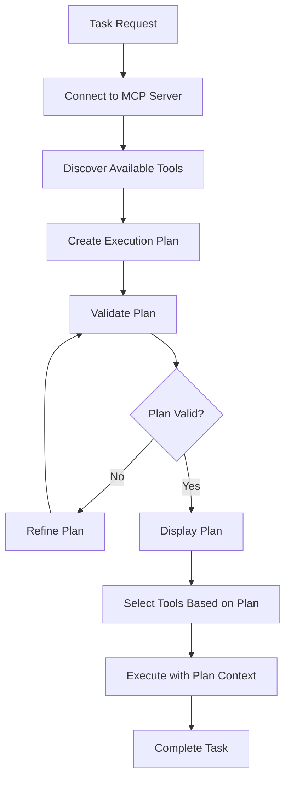
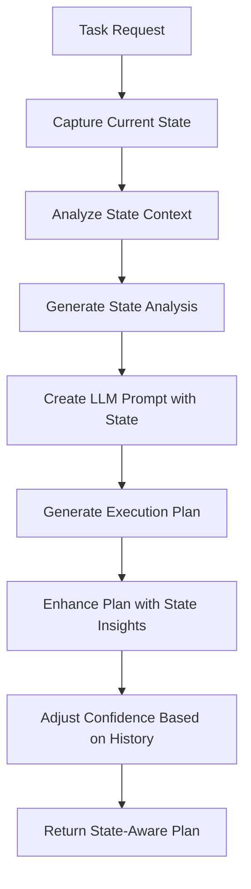

# Agent Planning System Design

## Overview

The Agent Planning System is a new component that enables the AI agent to formulate explicit execution plans before performing tasks. This system analyzes task requirements, creates step-by-step plans, identifies required tools, and guides execution through the planned steps.

## Architecture

### Core Components

#### 1. IPlanningService Interface
Defines the contract for planning functionality:
- `CreatePlanAsync()` - Creates detailed execution plans
- `RefinePlanAsync()` - Refines existing plans based on feedback
- `ValidatePlanAsync()` - Validates plan feasibility

#### 2. PlanningService Implementation
LLM-powered service that analyzes tasks and creates executable plans:
- Uses configurable planning model (defaults to conversation model)
- **Supports OpenAI reasoning models** (o1, o1-preview, o3, o3-mini) for enhanced planning capabilities
- Validates plans against available tools
- Supports plan refinement based on execution feedback
- Provides fallback plans for error scenarios
- Configurable via `PLANNING_MODEL` environment variable

#### 3. TaskPlan Model
Represents a complete execution plan:
- **Strategy**: High-level approach description
- **Steps**: Ordered list of execution steps
- **Required Tools**: Tools needed for plan execution
- **Complexity**: Estimated task complexity level
- **Confidence**: AI confidence in the plan (0.0-1.0)

#### 4. PlanStep Model
Represents individual plan steps:
- **Description**: What the step accomplishes
- **Potential Tools**: Tools that might be needed
- **Mandatory Flag**: Whether the step is required
- **Expected Input/Output**: Data flow expectations

### Planning Process Flow



## Integration with Existing Architecture

### Enhanced TaskExecutor
The TaskExecutor has been updated to include planning as a core phase:

1. **Connect to MCP Server** (unchanged)
2. **Initialize Conversation** (unchanged)
3. **Create Execution Plan** (NEW)
4. **Select Tools Based on Plan** (enhanced)
5. **Execute with Plan Context** (enhanced)
6. **Save Session** (unchanged)

### Tool Selection Enhancement
Tool selection now prioritizes tools mentioned in the execution plan:
- Plan-required tools are selected first
- Additional tools selected using existing intelligent selection
- Ensures plan requirements are met within token limits

### Conversation Context
The plan is provided as context to the conversation manager:
- Plan strategy and steps are shared with the AI
- Enables step-by-step execution tracking
- Improves task completion consistency

## Plan Creation Process

### 1. Task Analysis
The planning service analyzes the input task to understand:
- Task objectives and requirements
- Potential complexity levels
- Success criteria

### 2. Tool Assessment
Available tools are evaluated for:
- Relevance to task requirements
- Capability coverage
- Tool combinations needed

### 3. Strategy Formulation
A high-level strategy is developed considering:
- Most efficient approach
- Available tool capabilities
- Risk mitigation

### 4. Step Decomposition
The task is broken down into manageable steps:
- Logical sequence determination
- Tool mapping per step
- Input/output flow planning

### 5. Validation & Refinement
The plan is validated and refined:
- Tool availability verification
- Feasibility assessment
- Plan optimization

## Plan Complexity Levels

### Simple
- 1-3 execution steps
- Basic tool usage
- Single-domain tasks
- High confidence possible

### Medium
- 4-7 execution steps
- Multiple tool coordination
- Cross-domain tasks
- Moderate complexity

### Complex
- 8-12 execution steps
- Advanced tool orchestration
- Multi-phase execution
- Lower confidence expected

### Very Complex
- 12+ execution steps
- Sophisticated coordination
- Iterative refinement needed
- Experimental approaches

## Benefits

### 1. Improved Task Execution
- **Structured Approach**: Clear step-by-step guidance
- **Tool Optimization**: Better tool selection and usage
- **Consistency**: Reproducible execution patterns
- **Completeness**: Reduced task abandonment

### 2. Enhanced User Experience
- **Transparency**: Users see the planned approach
- **Confidence**: Clear execution strategy shown upfront
- **Debugging**: Plan helps identify execution issues
- **Learning**: Users understand AI reasoning

### 3. System Benefits
- **Efficiency**: Focused tool selection reduces context costs
- **Reliability**: Plan validation prevents impossible tasks
- **Scalability**: Structured approach handles complex tasks
- **Maintainability**: Clear separation of planning and execution

## Configuration Options

### Planning Model Selection
The planning system supports separate model configuration for optimal performance:
- **Default**: Uses the main conversation model (GPT-4.1 by default)
- **Reasoning Models**: Can be configured to use specialized OpenAI reasoning models:
  - **o1**: Advanced reasoning for complex planning scenarios
  - **o1-mini**: Faster reasoning for simpler planning tasks
  - **o1-preview**: Preview version of o1 reasoning model
  - **o3**: Latest reasoning model for sophisticated analysis
  - **o3-mini**: Efficient version of o3 for routine planning
- **Standard Models**: GPT-4, GPT-4-turbo for general planning
- **Temperature**: 0.2 (structured output optimized for planning)

### Plan Validation
- Tool availability checking
- Step sequence validation
- Feasibility assessment
- Confidence thresholds

### Display Options
- Plan visibility control
- Step detail levels
- Progress tracking
- Debug information

## Usage Examples

### Basic Planning with Reasoning Model
```csharp
// Configure separate models
var config = new AgentConfiguration
{
    Model = "gpt-4.1",              // For conversation
    PlanningModel = "o1-preview"    // For planning
};

var planningService = new PlanningService(config, openAiService, logger);
var plan = await planningService.CreatePlanAsync("Analyze Q4 sales data and create insights");
```

### Environment Variable Configuration
```bash
# Set conversation model
export AGENT_MODEL="gpt-4.1"

# Set specialized planning model
export PLANNING_MODEL="o1-preview"

# Or use o3 for more advanced reasoning
export PLANNING_MODEL="o3"
```

### Plan-Driven Execution
```csharp
var request = TaskExecutionRequest.FromTask("Analyze sales data from Q3 report");
await taskExecutor.ExecuteAsync(request);
// Automatically creates plan using configured planning model, validates, and executes
```

### Plan Refinement
```csharp
var refinedPlan = await planningService.RefinePlanAsync(originalPlan, 
    "User needs Excel output instead of CSV", availableTools);
```

## Enhanced State-Aware Planning

### Overview
The planning system has been enhanced to perform sophisticated analysis of the current state before creating execution plans. This enables the LLM to make more informed decisions based on context, history, user preferences, and environmental constraints.

### Current State Analysis
The system now captures and analyzes:

#### Session Context
- Previous conversation history
- Current task context and objectives
- User interaction patterns

#### Execution History  
- Previous task results (success/failure)
- Tools used in past executions
- Lessons learned and insights
- Performance patterns

#### User Preferences
- Preferred execution approach (thorough, fast, interactive)
- Tool preferences and avoidances
- Risk tolerance level (0.0 = conservative, 1.0 = high risk)
- Time constraints and priorities

#### Environment Capabilities
- Available computational resources
- Network connectivity and limitations
- File system access and storage
- Security constraints and permissions
- Current system performance metrics

#### Resource Availability
- Available data files and formats
- External services and APIs
- Tool-specific resources
- Custom configurations

### Enhanced Planning Process



### State-Aware Prompting
The LLM receives comprehensive context including:

1. **Task Description** - What needs to be accomplished
2. **State Analysis** - Detailed breakdown of current conditions
3. **Available Tools** - Tools and their capabilities
4. **Historical Context** - Previous execution results and insights
5. **User Context** - Preferences, constraints, and approach
6. **Environmental Context** - Capabilities, limitations, and constraints

### Planning Intelligence Features

#### Contextual Adaptation
- Plans adapt to user preferences (e.g., thorough vs. fast execution)
- Tool selection considers user preferences and past success rates
- Complexity adjusts based on available resources and constraints

#### Historical Learning
- Failed executions inform plan improvements
- Successful patterns are reinforced in new plans
- Tool effectiveness is tracked and applied

#### Risk Management
- Plans adjust complexity based on user risk tolerance
- Conservative users receive simpler, more reliable plans
- High-risk tolerance enables more innovative approaches

#### Resource Optimization
- Plans leverage available resources efficiently
- Environmental constraints guide tool and approach selection
- Performance metrics influence execution strategies

### API Usage Examples

#### Basic State-Aware Planning
```csharp
var currentState = new CurrentState
{
    SessionContext = "User working on data analysis project",
    UserPreferences = new UserPreferences
    {
        PreferredApproach = "thorough",
        RiskTolerance = 0.3
    }
};

var plan = await planningService.CreatePlanWithStateAnalysisAsync(
    "Analyze customer data and generate insights",
    availableTools,
    currentState
);
```

#### Plan Refinement with State
```csharp
var refinedPlan = await planningService.RefinePlanWithStateAsync(
    existingPlan,
    "Add statistical validation and error handling",
    availableTools,
    currentState
);
```

### Benefits of Enhanced Planning

1. **Improved Accuracy**: Plans are more realistic and executable
2. **User Alignment**: Plans match user preferences and constraints  
3. **Efficiency Optimization**: Better resource utilization and tool selection
4. **Learning Integration**: System improves over time based on results
5. **Risk Awareness**: Appropriate complexity for user comfort level
6. **Context Sensitivity**: Plans adapt to current environment and situation

## Future Enhancements

### Planned Features
1. **Interactive Planning**: User plan approval/modification
2. **Plan Templates**: Pre-defined patterns for common tasks
3. **Learning Integration**: Plan improvement from execution feedback
4. **Branching Plans**: Conditional execution paths
5. **Sub-task Planning**: Hierarchical plan decomposition
6. **Dynamic Re-planning**: Real-time plan adjustment during execution

### Metrics & Analytics
1. **Plan Accuracy**: Success rate by complexity level
2. **Tool Prediction**: Accuracy of required tool identification
3. **Execution Efficiency**: Plan vs. actual execution comparison
4. **User Satisfaction**: Plan quality feedback
5. **State Analysis Quality**: Effectiveness of context utilization

## Configuration

### Model Selection
The enhanced planning system supports different LLM models with separate configuration:
- **Conversation Model**: Used for iterative conversation and general tasks
  - Default: GPT-4.1 
  - Configurable via `AGENT_MODEL` environment variable
- **Planning Model**: Used specifically for task planning and reasoning
  - Default: Falls back to conversation model if not specified
  - Configurable via `PLANNING_MODEL` environment variable
  - **Recommended**: OpenAI reasoning models (o1, o1-mini, o3, o3-mini) for superior planning capabilities
- **Configuration**: 
  ```bash
  export AGENT_MODEL="gpt-4.1"          # For conversation
  export PLANNING_MODEL="o1-preview"    # For planning tasks
  ```

### Confidence Thresholds
Configure when to use enhanced planning:
- **Always**: Use state analysis for all planning
- **Complex Tasks**: Only for high-complexity scenarios
- **Low Confidence**: When basic planning confidence is low

### State Capture Settings
Control what state information to capture:
- **Full Context**: Comprehensive state analysis
- **Selective**: Only relevant context for the task type
- **Minimal**: Basic state information only

## Technical Implementation Notes

### Performance Considerations
- Planning uses lightweight GPT-3.5-turbo for speed
- Plan caching possible for similar tasks
- Validation is computationally efficient
- Memory footprint is minimal

### Error Handling
- Graceful fallback to adaptive execution
- Plan parsing error recovery
- Tool availability adaptation
- User-friendly error messages

### Extensibility
- Plugin architecture for specialized planners
- Custom plan validators
- Domain-specific planning strategies
- Integration with external planning tools

## Conclusion

The Agent Planning System transforms the AI agent from a reactive tool executor into a proactive task planner. By explicitly formulating execution strategies before acting, the agent provides users with transparency, improves task completion reliability, and optimizes resource usage. This enhancement represents a significant step toward more sophisticated AI agent capabilities while maintaining the system's ease of use and reliability.