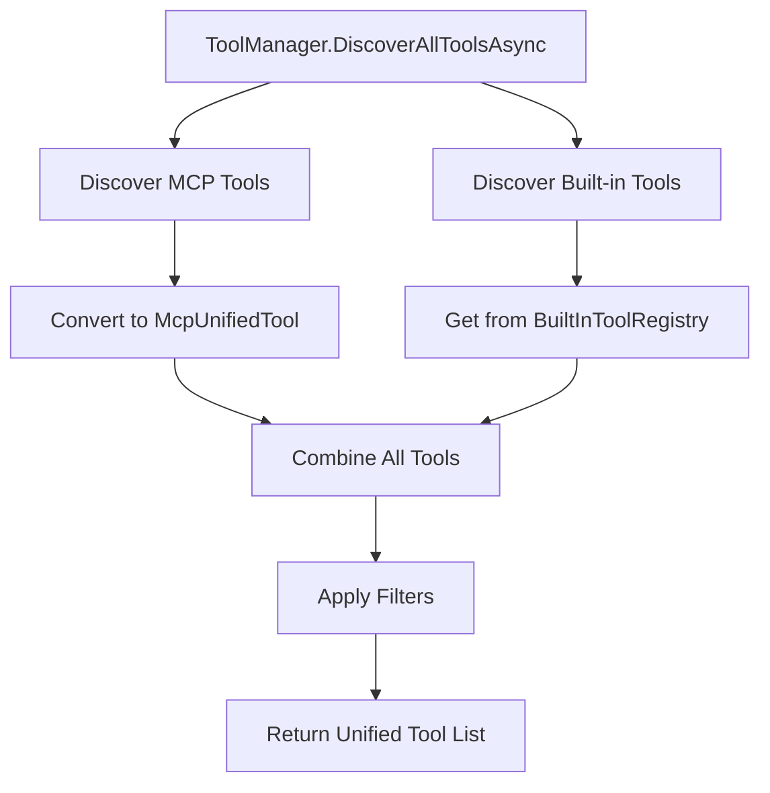

# Unified Tool Management System Design

## Problem Statement

The current AgentAlpha framework has a tool management system that only handles MCP (Model Context Protocol) tools, which are represented as `McpClientTool` objects. However, OpenAI also provides built-in tools like `web_search_preview` that are not MCP tools and therefore cannot be managed by the current `IToolManager` interface.

This creates a limitation where:
1. Built-in OpenAI tools cannot be properly discovered, filtered, or managed alongside MCP tools
2. The tool selection process is incomplete as it only considers MCP tools
3. OpenAI requests cannot easily include all available tool types in a unified manner

## Solution Architecture

### Core Design Principles

1. **Unified Abstraction**: All tools (MCP and built-in) should be represented by a common interface
2. **Backward Compatibility**: Existing MCP-specific code should continue to work unchanged
3. **Extensibility**: The system should easily accommodate new tool types in the future
4. **Transparent Management**: Consumers should not need to know whether a tool is MCP or built-in

### Key Components

#### 1. IUnifiedTool Interface

```csharp
/// <summary>
/// Unified interface for all tool types (MCP tools, built-in OpenAI tools, etc.)
/// </summary>
public interface IUnifiedTool
{
    /// <summary>
    /// Unique tool identifier
    /// </summary>
    string Name { get; }
    
    /// <summary>
    /// Human-readable tool description
    /// </summary>
    string Description { get; }
    
    /// <summary>
    /// Tool type (MCP, BuiltIn, etc.)
    /// </summary>
    ToolType Type { get; }
    
    /// <summary>
    /// Convert to OpenAI ToolDefinition for API requests
    /// </summary>
    ToolDefinition ToToolDefinition();
    
    /// <summary>
    /// Check if this tool can be executed in the current context
    /// </summary>
    bool CanExecute();
}
```

#### 2. Tool Type Enumeration

```csharp
/// <summary>
/// Types of tools supported by the unified system
/// </summary>
public enum ToolType
{
    /// <summary>
    /// Tool from MCP server
    /// </summary>
    MCP,
    
    /// <summary>
    /// Built-in OpenAI tool
    /// </summary>
    BuiltInOpenAI,
    
    /// <summary>
    /// Custom agent tool
    /// </summary>
    Custom
}
```

#### 3. Concrete Tool Implementations

**McpUnifiedTool**: Wraps existing `McpClientTool` objects
```csharp
public class McpUnifiedTool : IUnifiedTool
{
    private readonly McpClientTool _mcpTool;
    private readonly IToolManager _toolManager;
    
    // Implementation that delegates to existing MCP tool functionality
}
```

**BuiltInOpenAITool**: Represents built-in OpenAI tools
```csharp
public class BuiltInOpenAITool : IUnifiedTool
{
    // Implementation for built-in tools like web_search_preview
    // Uses existing WebSearchTool and similar classes
}
```

#### 4. Enhanced IToolManager Interface

```csharp
public interface IToolManager
{
    // Existing MCP-specific methods (maintained for backward compatibility)
    Task<IList<McpClientTool>> DiscoverToolsAsync(IConnectionManager connection);
    IList<McpClientTool> ApplyFilters(IList<McpClientTool> tools, ToolFilterConfig filter);
    ToolDefinition CreateOpenAiToolDefinition(McpClientTool mcpTool);
    Task<string> ExecuteToolAsync(IConnectionManager connection, string toolName, Dictionary<string, object?> arguments);
    
    // New unified methods
    Task<IList<IUnifiedTool>> DiscoverAllToolsAsync(IConnectionManager connection);
    IList<IUnifiedTool> ApplyFiltersToAllTools(IList<IUnifiedTool> tools, ToolFilterConfig filter);
    Task<string> ExecuteUnifiedToolAsync(IUnifiedTool tool, Dictionary<string, object?> arguments);
}
```

#### 5. Built-in Tool Registry

```csharp
/// <summary>
/// Registry of available built-in OpenAI tools
/// </summary>
public interface IBuiltInToolRegistry
{
    /// <summary>
    /// Get all available built-in tools based on current configuration
    /// </summary>
    IList<IUnifiedTool> GetAvailableBuiltInTools();
    
    /// <summary>
    /// Get a specific built-in tool by name
    /// </summary>
    IUnifiedTool? GetBuiltInTool(string toolName);
    
    /// <summary>
    /// Register a new built-in tool
    /// </summary>
    void RegisterBuiltInTool(IUnifiedTool tool);
}
```

## Implementation Strategy

### Phase 1: Foundation (Minimal Changes)

1. **Create Core Interfaces**: Add `IUnifiedTool`, `ToolType` enum, and registry interface
2. **Implement Tool Wrappers**: Create `McpUnifiedTool` and `BuiltInOpenAITool` classes
3. **Extend IToolManager**: Add new methods while keeping existing ones
4. **Create Built-in Tool Registry**: Implement registry with web search tool

### Phase 2: Integration (Backward Compatible)

1. **Update ToolManager**: Implement new unified methods
2. **Enhance ToolSelector**: Update to work with unified tools
3. **Modify TaskExecutor**: Use unified tools while maintaining MCP compatibility
4. **Register Built-in Tools**: Add web search and any other built-in tools

### Phase 3: Testing & Documentation

1. **Create Comprehensive Tests**: Test both MCP and built-in tool functionality
2. **Verify Backward Compatibility**: Ensure existing code continues to work
3. **Performance Testing**: Ensure no performance degradation
4. **Documentation**: Create usage examples and migration guides

## Tool Execution Strategy

### MCP Tools
- Execution delegated to existing `IConnectionManager.CallToolAsync()`
- Uses established MCP protocol for tool calls

### Built-in OpenAI Tools
- Included in OpenAI API requests as tool definitions
- Execution handled by OpenAI directly (no local execution needed)
- Results returned in OpenAI response and processed normally

### Unified Tool Discovery Flow



## Configuration Integration

Built-in tools will be configured through the existing `AgentConfiguration` class:

```csharp
public class AgentConfiguration
{
    // Existing properties...
    
    /// <summary>
    /// Built-in tool configurations
    /// </summary>
    public BuiltInToolsConfig BuiltInTools { get; set; } = new();
}

public class BuiltInToolsConfig
{
    /// <summary>
    /// Web search tool configuration
    /// </summary>
    public WebSearchTool? WebSearch { get; set; }
    
    /// <summary>
    /// Enable/disable built-in tools globally
    /// </summary>
    public bool EnableBuiltInTools { get; set; } = true;
}
```

## Benefits

1. **Unified Management**: All tools are managed through a single interface
2. **Complete Tool Selection**: Tool selection considers all available tools
3. **Proper Filtering**: Built-in tools can be filtered alongside MCP tools
4. **OpenAI Integration**: All tools can be properly provided to OpenAI requests
5. **Future-Proof**: Easy to add new tool types (e.g., custom tools, other AI providers)
6. **Backward Compatibility**: Existing MCP-specific code continues to work unchanged

## Migration Path

### For Existing Code

No changes required - existing `IToolManager` methods continue to work exactly as before.

### For New Code

Use the new unified methods:
```csharp
// Old way (still works)
var mcpTools = await toolManager.DiscoverToolsAsync(connection);

// New way (recommended)
var allTools = await toolManager.DiscoverAllToolsAsync(connection);
```

### Tool Selection

The `IToolSelector` interface will be updated to work with unified tools, but maintain the same public API for backward compatibility.

## Future Enhancements

1. **Custom Tool Support**: Add support for custom agent-specific tools
2. **Tool Caching**: Cache tool definitions to improve performance
3. **Dynamic Tool Loading**: Load tools from external assemblies
4. **Tool Versioning**: Support for tool version management
5. **Tool Dependencies**: Handle dependencies between tools

## Testing Strategy

1. **Unit Tests**: Test each component individually
2. **Integration Tests**: Test tool discovery and execution flows
3. **Backward Compatibility Tests**: Ensure existing functionality is preserved
4. **Performance Tests**: Verify no performance degradation
5. **End-to-End Tests**: Test complete workflows with both tool types

This design ensures that the AgentAlpha framework can handle all types of tools in a unified, extensible manner while maintaining complete backward compatibility with existing MCP-based implementations.