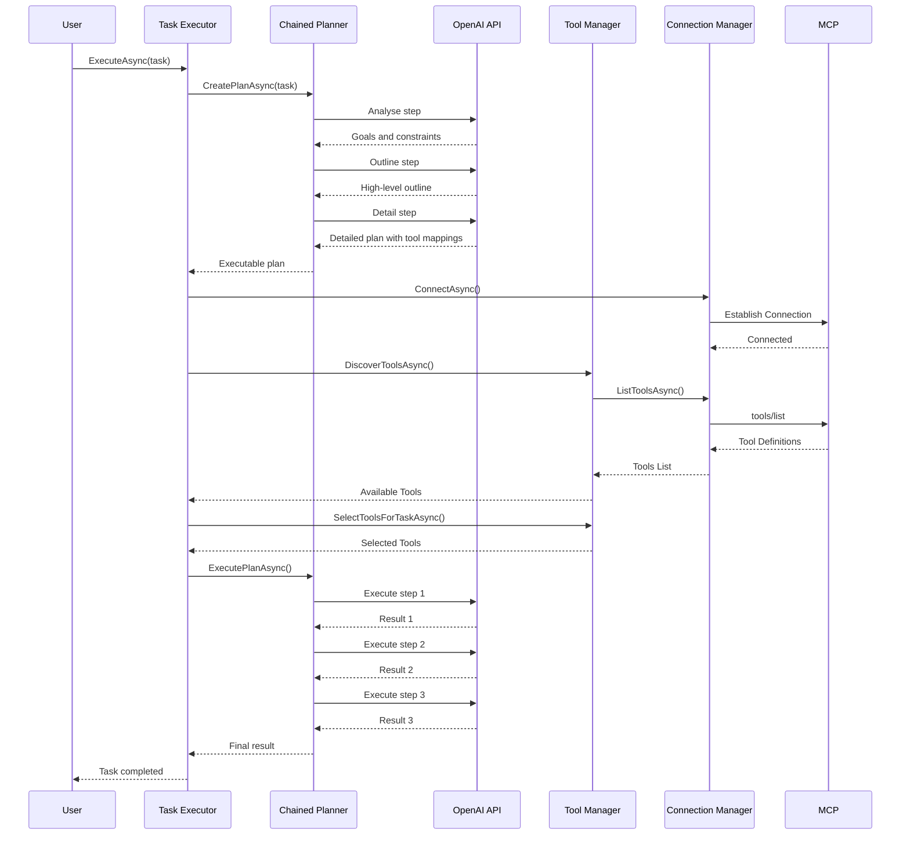

# P2 – Prompt-Chaining Planner

## Overview
Replace single PlanningService call with Analyse → Outline → Detail chain for higher quality plans.

## New Services
- `ChainedPlanner` implements `IPlanner` (new interface).  
- Uses three sequential `OpenAIResponsesService` calls with gates.

## Step Prompts
1. **Analyse** – extract goals, constraints, tool gaps.  
2. **Outline** – high-level step list.  
3. **Detail** – expand each step incl. tool mappings.

## Interaction
`TaskExecutor` asks `IPlanner.CreatePlanAsync()`.  
ChainedPlanner can fall back to existing PlanningService on error.

## Sequence Diagram

## Testing
- Unit tests per stage (mock OpenAI).  
- Integration test comparing plan quality score vs baseline.

## Migration
Register `IPlanner` with feature flag `USE_CHAINED_PLANNER=true`.