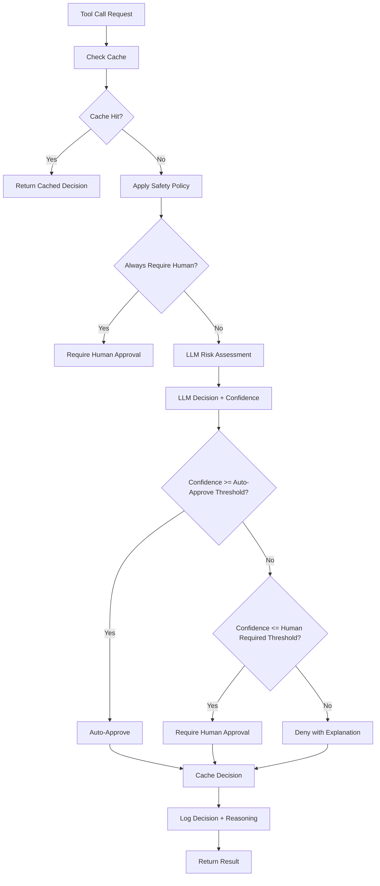

# LLM-Driven Tool Approval System Design

## Executive Summary

This document extends the existing Human-in-the-Loop Tool Approval System to enable Large Language Models (LLMs) to make intelligent approval decisions for tool calls. The design maintains safety-first principles while reducing human intervention for routine, low-risk operations.

## 1. Goals

* **Intelligent Automation** – LLMs can automatically approve safe tool calls, reducing human intervention for routine operations
* **Safety First** – Maintain the existing safety guarantees; when in doubt, require human approval
* **Configurable Policies** – Allow fine-tuning of what the LLM can auto-approve through policy configuration
* **Transparent Decision Making** – All LLM decisions are logged and auditable with reasoning explanations
* **Fallback Mechanisms** – Robust fallback to human approval when LLM is unavailable or uncertain
* **Performance Optimization** – Cache common decisions and patterns to avoid repeated LLM calls

## 2. Key Concepts

| Term | Description |
|------|-------------|
| LLM Approval Provider | An approval provider that uses LLM reasoning to make approval decisions |
| Safety Policy | Configurable rules that define what types of tool calls can be auto-approved |
| Risk Assessment | LLM evaluation of tool call risk based on tool type, arguments, and context |
| Approval Confidence | LLM's confidence score in its approval decision (0.0 - 1.0) |
| Hybrid Approval | Combination of LLM and human approval based on confidence thresholds |
| Decision Cache | Cache of previous LLM decisions to improve performance |

## 3. Architecture Overview

```
┌─────────────────┐    ┌──────────────────┐    ┌─────────────────┐
│   Tool Call     │    │  Approval        │    │  LLM Approval   │
│   [Requires     │───▶│  Manager         │───▶│  Provider       │
│    Approval]    │    │                  │    │                 │
└─────────────────┘    └──────────────────┘    └─────────────────┘
                                                        │
                                               ┌─────────────────┐
                                               │  LLM Service    │
                                               │  (OpenAI/Azure/ │
                                               │   Local Model)  │
                                               └─────────────────┘
                                                        │
                                          ┌─────────────────────────┐
                                          │     Safety Policy       │
                                          │     Evaluation          │
                                          │  ┌─────────────────┐    │
                                          │  │ Risk Assessment │    │
                                          │  │ Confidence Score│    │
                                          │  │ Decision Cache  │    │
                                          │  └─────────────────┘    │
                                          └─────────────────────────┘
                                                        │
                                          ┌─────────────────────────┐
                                          │    Decision Logic       │
                                          │                         │
                                          │ Auto-Approve            │
                                          │    ↓                    │
                                          │ Require Human           │
                                          │    ↓                    │
                                          │ Deny                    │
                                          └─────────────────────────┘
```

## 4. LLM Approval Provider Design

### 4.1 Core Components

#### LLM Service Interface
```csharp
public interface ILlmService
{
    Task<LlmApprovalDecision> EvaluateToolCallAsync(
        string toolName, 
        IReadOnlyDictionary<string, object?> arguments,
        LlmApprovalContext context,
        CancellationToken cancellationToken = default);
}

public record LlmApprovalDecision(
    ApprovalResult Result,
    double Confidence,
    string Reasoning,
    TimeSpan ProcessingTime);

public enum ApprovalResult
{
    Approve,
    RequireHuman,
    Deny
}
```

#### Safety Policy Configuration
```csharp
public class LlmApprovalPolicy
{
    // Confidence thresholds
    public double AutoApprovalMinConfidence { get; set; } = 0.85;
    public double HumanRequiredMaxConfidence { get; set; } = 0.50;
    
    // Tool-specific policies
    public Dictionary<string, ToolPolicy> ToolPolicies { get; set; } = new();
    
    // Global restrictions
    public List<string> AlwaysRequireHuman { get; set; } = new();
    public List<string> NeverAutoApprove { get; set; } = new();
    
    // Risk categories
    public Dictionary<RiskCategory, RiskPolicy> RiskPolicies { get; set; } = new();
}

public class ToolPolicy
{
    public bool AllowAutoApproval { get; set; } = true;
    public double MinConfidenceOverride { get; set; } = 0.85;
    public List<ArgumentPolicy> ArgumentPolicies { get; set; } = new();
}

public enum RiskCategory
{
    Safe,           // Read operations, calculations
    Moderate,       // File operations with specific patterns
    High,           // System operations, network calls
    Critical        // Destructive operations, security changes
}
```

### 4.2 Decision Flow



### 4.3 LLM Prompt Design

The LLM will receive a structured prompt for tool approval evaluation:

```
You are a security-focused tool approval system. Evaluate whether the following tool call should be approved automatically, requires human approval, or should be denied.

TOOL CALL DETAILS:
- Tool Name: {toolName}
- Arguments: {arguments}
- Context: {context}

EVALUATION CRITERIA:
1. Safety Assessment: Is this operation destructive, reversible, or read-only?
2. Argument Analysis: Do the arguments contain sensitive data or dangerous patterns?
3. Risk Level: What is the potential impact if this operation fails or is misused?
4. Context Appropriateness: Is this tool call appropriate for the current context?

SAFETY POLICIES:
{policies}

Respond with a JSON object containing:
{
  "result": "approve" | "require_human" | "deny",
  "confidence": 0.0-1.0,
  "reasoning": "Detailed explanation of the decision",
  "risk_category": "safe" | "moderate" | "high" | "critical",
  "concerns": ["list", "of", "specific", "concerns"]
}
```

## 5. Implementation Strategy

### 5.1 Phase 1: Core LLM Provider
- Implement `LlmApprovalProvider` class
- Add basic LLM service integration (OpenAI, Azure OpenAI)
- Implement safety policy evaluation
- Add decision caching mechanism

### 5.2 Phase 2: Advanced Features
- Add hybrid approval (LLM + human fallback)
- Implement decision confidence scoring
- Add policy configuration UI
- Enhanced logging and audit trails

### 5.3 Phase 3: Optimization
- Machine learning from human corrections
- Advanced caching strategies
- Performance monitoring and metrics
- Policy recommendation system

## 6. Configuration Examples

### 6.1 Basic LLM Approval Configuration
```csharp
var config = new ApprovalProviderConfiguration
{
    ProviderType = ApprovalProviderType.Llm,
    LlmProvider = new LlmProviderConfig
    {
        ServiceType = LlmServiceType.OpenAI,
        ApiKey = "your-openai-api-key",
        Model = "gpt-4",
        AutoApprovalMinConfidence = 0.85,
        HumanFallbackMaxConfidence = 0.50,
        CacheEnabled = true,
        CacheTtl = TimeSpan.FromHours(1)
    }
};
```

### 6.2 Advanced Policy Configuration
```csharp
var policy = new LlmApprovalPolicy
{
    AutoApprovalMinConfidence = 0.85,
    HumanRequiredMaxConfidence = 0.50,
    
    ToolPolicies = new Dictionary<string, ToolPolicy>
    {
        ["read_file"] = new ToolPolicy 
        { 
            AllowAutoApproval = true, 
            MinConfidenceOverride = 0.70 
        },
        ["delete_file"] = new ToolPolicy 
        { 
            AllowAutoApproval = false // Always require human
        }
    },
    
    AlwaysRequireHuman = new List<string> 
    { 
        "execute_shell", 
        "delete_database", 
        "modify_security_settings" 
    },
    
    RiskPolicies = new Dictionary<RiskCategory, RiskPolicy>
    {
        [RiskCategory.Safe] = new RiskPolicy { AllowAutoApproval = true, MinConfidence = 0.70 },
        [RiskCategory.Critical] = new RiskPolicy { AllowAutoApproval = false }
    }
};
```

## 7. Safety Guarantees

### 7.1 Defense in Depth
1. **Policy Enforcement**: Hard-coded policies that cannot be overridden by LLM
2. **Confidence Thresholds**: Configurable confidence requirements for auto-approval
3. **Human Fallback**: Always available as a backup approval mechanism
4. **Audit Logging**: Complete decision trail with LLM reasoning
5. **Rate Limiting**: Prevent abuse through request throttling

### 7.2 Fail-Safe Mechanisms
- **LLM Unavailable**: Fall back to human approval provider
- **Low Confidence**: Require human approval when LLM is uncertain
- **Policy Violations**: Override LLM decision when policies are violated
- **Timeout Handling**: Default to denial if LLM takes too long

## 8. Performance Considerations

### 8.1 Caching Strategy
- **Decision Cache**: Cache LLM decisions for identical tool calls
- **Pattern Cache**: Cache decisions for similar argument patterns  
- **Policy Cache**: Cache policy evaluations to avoid repeated computations
- **TTL Management**: Configurable cache expiration times

### 8.2 Optimization Techniques
- **Batch Processing**: Group multiple tool calls for efficient LLM evaluation
- **Parallel Processing**: Evaluate multiple aspects concurrently
- **Model Selection**: Use appropriate model size for the complexity needed
- **Request Deduplication**: Avoid duplicate LLM calls for same requests

## 9. Integration with Existing System

### 9.1 Backward Compatibility
The LLM approval provider integrates seamlessly with the existing system:

```csharp
// Existing usage - no changes required
[McpServerTool(Name = "delete_file"), RequiresApproval]
public static string DeleteFile(string path) { /* ... */ }

// New usage - optional configuration for LLM evaluation
[McpServerTool(Name = "read_file"), RequiresApproval]
[LlmApprovalPolicy(AllowAutoApproval = true, MinConfidence = 0.80)]
public static string ReadFile(string path) { /* ... */ }
```

### 9.2 Provider Selection
Users can choose their approval strategy:

```csharp
// Environment-based configuration
APPROVAL_PROVIDER_TYPE=llm
LLM_SERVICE_TYPE=openai
LLM_API_KEY=your-key
LLM_AUTO_APPROVAL_MIN_CONFIDENCE=0.85

// Programmatic configuration
var manager = new ToolApprovalManager(new ApprovalProviderConfiguration
{
    ProviderType = ApprovalProviderType.Llm,
    LlmProvider = new LlmProviderConfig { /* ... */ }
});
```

## 10. Monitoring and Observability

### 10.1 Metrics
- **Decision Accuracy**: Track LLM decisions vs. human overrides
- **Confidence Distribution**: Monitor confidence score patterns
- **Performance Metrics**: Response times, cache hit rates
- **Safety Metrics**: Track denied requests and policy violations

### 10.2 Logging
```csharp
public class LlmApprovalDecisionLog
{
    public Guid DecisionId { get; set; }
    public string ToolName { get; set; }
    public Dictionary<string, object?> Arguments { get; set; }
    public ApprovalResult Result { get; set; }
    public double Confidence { get; set; }
    public string Reasoning { get; set; }
    public TimeSpan ProcessingTime { get; set; }
    public DateTimeOffset Timestamp { get; set; }
    public string LlmModel { get; set; }
    public bool CacheHit { get; set; }
}
```

## 11. Testing Strategy

### 11.1 Unit Tests
- Test policy evaluation logic
- Test confidence threshold enforcement
- Test fallback mechanisms
- Test caching behavior

### 11.2 Integration Tests
- Test LLM service integration
- Test end-to-end approval flow
- Test human fallback scenarios
- Test performance under load

### 11.3 Safety Tests
- Test policy enforcement
- Test malicious input handling
- Test edge cases and error conditions
- Test fail-safe mechanisms

## 12. Deployment Considerations

### 12.1 Staging Deployment
- Start with read-only operations
- Gradually expand to low-risk operations
- Monitor decision accuracy
- Collect human feedback

### 12.2 Production Deployment
- Implement blue-green deployment
- Monitor error rates and performance
- Maintain human override capabilities
- Regular policy review and updates

## 13. Future Enhancements

### 13.1 Machine Learning Integration
- Learn from human approval patterns
- Adapt policies based on usage data
- Improve confidence scoring accuracy
- Detect policy drift over time

### 13.2 Advanced Features
- Multi-model ensemble decisions
- Context-aware approval (time, user, environment)
- Dynamic policy adjustment
- Predictive risk assessment

## 14. Migration Guide

Organizations can migrate to LLM-driven approval in phases:

1. **Assessment Phase**: Analyze current tool usage patterns
2. **Policy Development**: Create initial safety policies
3. **Pilot Deployment**: Deploy with conservative settings
4. **Gradual Expansion**: Increase auto-approval scope
5. **Optimization**: Fine-tune based on operational data

## 15. Conclusion

The LLM-driven tool approval system extends the existing human-in-the-loop architecture to provide intelligent automation while maintaining safety guarantees. By leveraging LLM reasoning capabilities with robust safety policies and fallback mechanisms, organizations can reduce human intervention for routine operations while ensuring critical decisions still receive human oversight.

The design prioritizes safety, configurability, and observability, making it suitable for production deployment in security-conscious environments.

---

*This design document serves as the foundation for implementing LLM-driven tool approval capabilities in the existing system.*