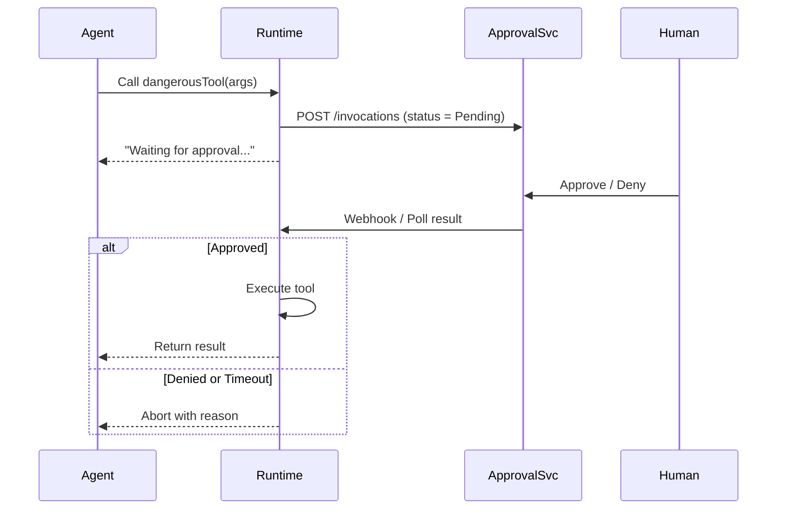

# Human-in-the-Loop Tool Approval System

## 1. Goals
* **Safety first** – potentially dangerous tools (file deletion, shell execution, network calls, etc.) must not run without explicit human consent.  
* **Low friction** – writing a new tool should require *zero* boilerplate to enter the approval workflow.  
* **Auditability** – keep an immutable record of who approved what, when, with which parameters and outcome.  
* **Pluggability** – the agent runtime should work even when the approval backend is unavailable (fallback modes, cached approvals).  

## 2. Key Concepts
| Term              | Description                                                         |
|-------------------|---------------------------------------------------------------------|
| Tool              | A static method decorated with `[McpServerTool]`.                   |
| Invocation Token  | A JSON blob describing *one* call (tool-name, args, metadata).      |
| Approval Status   | `Pending`, `Approved`, `Denied`, `Expired`.                         |
| Approval Backend  | A message broker or REST API where tokens are queued & resolved.    |

## 3. Developer Ergonomics
```csharp
[McpServerTool(Name = "delete_file", RequiresApproval = true)]
public static string DeleteFile(string path) { /* ... */ }
```
*Add `RequiresApproval = true` flag (default: false).*  
No further changes are needed; the runtime intercepts the call.

## 4. Runtime Flow


## 5. Transport Options
1. **REST + Webhooks** (easy to prototype, firewall-friendly).  
2. **Message Queue** (RabbitMQ, NATS, etc.) for large-scale concurrency.  
3. **Local “Prompt” Driver** – for CLI demos the runtime writes the token to stderr and pauses for y/n.

## 6. Security & Audit
* Tokens are signed (JWT or HMAC) to prevent tampering.  
* All state transitions are stored in an append-only database (SQLite ok for starters).  
* Optionally include input/output hashes for reproducibility.

## 7. Extensibility
* `RequiresApprovalPolicy` delegate lets repos override logic (e.g., auto-approve low-risk ops).  
* UI dashboard filters by risk, time, user.  
* SDK for mobile push notifications.

## 8. Implementation Milestones
1. **MVP** ✅ COMPLETED
   * Attribute flag + runtime intercept.
   * ~~File-based queue + CLI prompt driver~~ → Console approval backend.
   * Async approval workflow with pluggable backends.
2. **REST Backend** ✅ COMPLETED  
   * Remote approval backend with HTTP polling.
   * Configuration system for different backends.
   * ~~ASP.NET Core service with SQLite~~ → Example service provided.
   * ~~Basic web UI~~ → Can be added separately.
3. **Enterprise** 🚧 FUTURE
   * OAuth sign-in, RBAC.
   * Message queue transport.
   * Metrics / alerting hooks.

## 9. Implementation Details

### Current Architecture
The tool approval system has been implemented with the following components:

- **`IApprovalBackend`**: Interface for pluggable approval mechanisms
- **`ConsoleApprovalBackend`**: Local console-based approval (backward compatible)  
- **`RemoteApprovalBackend`**: HTTP-based remote approval for cloud deployments
- **`ToolApprovalManager`**: Central manager with async approval workflow
- **`ToolApprovalOptions`**: Configuration system for backend selection

### Backend Configuration
```csharp
// Console approval (default, backward compatible)
var consoleOptions = new ToolApprovalOptions
{
    BackendType = ApprovalBackendType.Console
};

// Remote approval for cloud deployments
var remoteOptions = new ToolApprovalOptions
{
    BackendType = ApprovalBackendType.Remote,
    RemoteConfig = new RemoteApprovalConfig
    {
        BaseUrl = "https://approval-service.example.com",
        ApiKey = "your-api-key",
        ApprovalTimeout = TimeSpan.FromMinutes(5),
        PollInterval = TimeSpan.FromSeconds(2)
    }
};

// Apply configuration
ToolApprovalManager.Instance.SetApprovalBackend(options.CreateBackend());
```

### Migration Path
- Existing code continues to work unchanged (console approval)
- New deployments can opt into remote approval
- The async `EnsureApprovedAsync` method is now the preferred API
- Legacy `EnsureApproved` method is marked obsolete but still functional

---

*Feel free to iterate on naming, transport and storage—this document is a starting point, not a contract.*