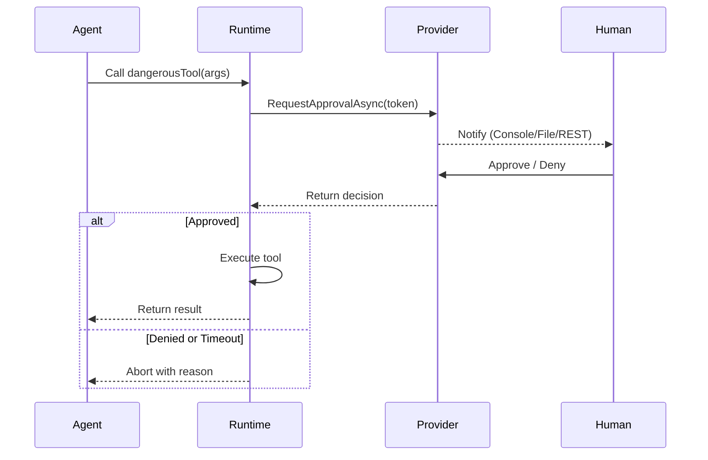

# Human-in-the-Loop Tool Approval System

## 1. Goals
* **Safety first** – potentially dangerous tools (file deletion, shell execution, network calls, etc.) must not run without explicit human consent.  
* **Low friction** – writing a new tool should require *zero* boilerplate to enter the approval workflow.  
* **Auditability** – keep an immutable record of who approved what, when, with which parameters and outcome.  
* **Pluggability** – the agent runtime should work even when the approval backend is unavailable (fallback modes, cached approvals).  

## 2. Key Concepts
| Term              | Description                                                         |
|-------------------|---------------------------------------------------------------------|
| Tool              | A static method decorated with `[McpServerTool]`.                   |
| Invocation Token  | A JSON blob describing *one* call (tool-name, args, metadata).      |
| Approval Status   | `Pending`, `Approved`, `Denied`, `Expired`.                         |
| Approval Provider | A pluggable service that handles approval requests (Console, File, REST). |
| Approval Backend  | A message broker or REST API where tokens are queued & resolved.    |

## 3. Developer Ergonomics
```csharp
[McpServerTool(Name = "delete_file"), RequiresApproval]
public static string DeleteFile(string path) { /* ... */ }
```
*Add `RequiresApproval` attribute (default: `Required = true`).*  
No further changes are needed; the runtime intercepts the call.

## 4. Runtime Flow


## 5. Approval Providers

### Console Provider (Default)
- **Use case**: Local development with immediate approval
- **Behavior**: Synchronous console prompt (`y/N`)
- **Configuration**: No configuration needed

### File Provider
- **Use case**: Local development with external approval tools
- **Behavior**: Writes approval requests to files, polls for responses
- **Configuration**: 
  ```csharp
  var config = new ApprovalProviderConfiguration
  {
      ProviderType = ApprovalProviderType.File,
      FileProvider = new FileProviderConfig
      {
          ApprovalDirectory = "./approvals",
          PollInterval = TimeSpan.FromSeconds(1),
          Timeout = TimeSpan.FromMinutes(5)
      }
  };
  ```

### REST Provider
- **Use case**: Cloud deployment with web-based approval interface
- **Behavior**: Submits requests to REST API, polls for decisions
- **Configuration**:
  ```csharp
  var config = new ApprovalProviderConfiguration
  {
      ProviderType = ApprovalProviderType.Rest,
      RestProvider = new RestProviderConfig
      {
          BaseUrl = "http://approval-service:5000",
          PollInterval = TimeSpan.FromSeconds(2),
          Timeout = TimeSpan.FromMinutes(10),
          AuthToken = "bearer-token-here"
      }
  };
  ```

## 6. Configuration & Usage

### Basic Setup (Console - Default)
```csharp
// No configuration needed - uses console by default
var manager = ToolApprovalManager.Instance;
```

### File-based Setup
```csharp
var config = new ApprovalProviderConfiguration
{
    ProviderType = ApprovalProviderType.File
};
var manager = new ToolApprovalManager(config);
```

### REST-based Setup
```csharp
var config = new ApprovalProviderConfiguration
{
    ProviderType = ApprovalProviderType.Rest,
    RestProvider = new RestProviderConfig
    {
        BaseUrl = Environment.GetEnvironmentVariable("APPROVAL_SERVICE_URL") ?? "http://localhost:5000"
    }
};
var manager = new ToolApprovalManager(config);
```

## 7. Approval Service

A standalone ASP.NET Core service provides REST API and web UI for approvals:

### API Endpoints
- `POST /api/approvals` - Submit approval request
- `GET /api/approvals/{id}` - Get approval status
- `POST /api/approvals/{id}/approve` - Approve request
- `POST /api/approvals/{id}/deny` - Deny request
- `GET /api/approvals` - List pending approvals

### Web Interface
- Available at `http://localhost:5000`
- Real-time dashboard showing pending requests
- One-click approve/deny buttons
- Auto-refresh every 5 seconds

### Running the Approval Service
```bash
cd src/ApprovalService
dotnet run
```

## 8. Security & Audit
* All approval decisions are stored in SQLite database with timestamps
* Tokens include tool name, arguments, and creation time
* Future: JWT signing, authentication, authorization
* Audit trail available through both `ToolApprovalManager.AuditTrail` and approval service

## 9. Extensibility
* `IApprovalProvider` interface allows custom approval mechanisms
* `ApprovalProviderFactory` supports new provider types
* Configuration-driven provider selection
* Future: Plugin system, custom UI themes, notification channels

## 10. Migration Guide

### From Console-Only to Provider Pattern
**Before:**
```csharp
// Hard-coded console approval
var approved = ToolApprovalManager.Instance.EnsureApproved(toolName, args);
```

**After:**
```csharp
// Configurable approval provider
var approved = await ToolApprovalManager.Instance.EnsureApprovedAsync(toolName, args);
// Or synchronous (backwards compatible):
var approved = ToolApprovalManager.Instance.EnsureApproved(toolName, args);
```

### Backwards Compatibility
- Default behavior unchanged (console approval)
- Existing `EnsureApproved` method still works
- New `EnsureApprovedAsync` method available for better performance

## 11. Implementation Status

✅ **MVP Complete**
- [x] Provider abstraction layer (`IApprovalProvider`)
- [x] Console provider (maintains existing behavior)
- [x] File provider (for local development)
- [x] REST provider (for cloud deployment)
- [x] Configuration system
- [x] Async approval support
- [x] Backwards compatibility

✅ **REST Backend Complete**
- [x] ASP.NET Core approval service
- [x] SQLite storage
- [x] REST API
- [x] Web UI dashboard
- [x] Swagger documentation

🔄 **Future Enhancements**
- [ ] Authentication & authorization
- [ ] Message queue transport
- [ ] Mobile notifications
- [ ] Advanced analytics
- [ ] Multi-tenant support

---

*The approval system now supports multiple deployment scenarios while maintaining the simple developer experience.*