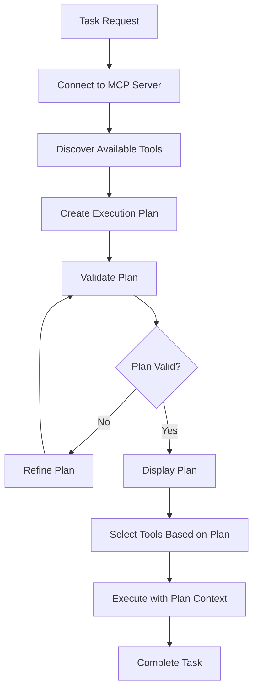

# Agent Planning System Design

## Overview

The Agent Planning System is a new component that enables the AI agent to formulate explicit execution plans before performing tasks. This system analyzes task requirements, creates step-by-step plans, identifies required tools, and guides execution through the planned steps.

## Architecture

### Core Components

#### 1. IPlanningService Interface
Defines the contract for planning functionality:
- `CreatePlanAsync()` - Creates detailed execution plans
- `RefinePlanAsync()` - Refines existing plans based on feedback
- `ValidatePlanAsync()` - Validates plan feasibility

#### 2. PlanningService Implementation
LLM-powered service that analyzes tasks and creates executable plans:
- Uses GPT-3.5-turbo for fast plan generation
- Validates plans against available tools
- Supports plan refinement based on execution feedback

#### 3. TaskPlan Model
Represents a complete execution plan:
- **Strategy**: High-level approach description
- **Steps**: Ordered list of execution steps
- **Required Tools**: Tools needed for plan execution
- **Complexity**: Estimated task complexity level
- **Confidence**: AI confidence in the plan (0.0-1.0)

#### 4. PlanStep Model
Represents individual plan steps:
- **Description**: What the step accomplishes
- **Potential Tools**: Tools that might be needed
- **Mandatory Flag**: Whether the step is required
- **Expected Input/Output**: Data flow expectations

### Planning Process Flow



## Integration with Existing Architecture

### Enhanced TaskExecutor
The TaskExecutor has been updated to include planning as a core phase:

1. **Connect to MCP Server** (unchanged)
2. **Initialize Conversation** (unchanged)
3. **Create Execution Plan** (NEW)
4. **Select Tools Based on Plan** (enhanced)
5. **Execute with Plan Context** (enhanced)
6. **Save Session** (unchanged)

### Tool Selection Enhancement
Tool selection now prioritizes tools mentioned in the execution plan:
- Plan-required tools are selected first
- Additional tools selected using existing intelligent selection
- Ensures plan requirements are met within token limits

### Conversation Context
The plan is provided as context to the conversation manager:
- Plan strategy and steps are shared with the AI
- Enables step-by-step execution tracking
- Improves task completion consistency

## Plan Creation Process

### 1. Task Analysis
The planning service analyzes the input task to understand:
- Task objectives and requirements
- Potential complexity levels
- Success criteria

### 2. Tool Assessment
Available tools are evaluated for:
- Relevance to task requirements
- Capability coverage
- Tool combinations needed

### 3. Strategy Formulation
A high-level strategy is developed considering:
- Most efficient approach
- Available tool capabilities
- Risk mitigation

### 4. Step Decomposition
The task is broken down into manageable steps:
- Logical sequence determination
- Tool mapping per step
- Input/output flow planning

### 5. Validation & Refinement
The plan is validated and refined:
- Tool availability verification
- Feasibility assessment
- Plan optimization

## Plan Complexity Levels

### Simple
- 1-3 execution steps
- Basic tool usage
- Single-domain tasks
- High confidence possible

### Medium
- 4-7 execution steps
- Multiple tool coordination
- Cross-domain tasks
- Moderate complexity

### Complex
- 8-12 execution steps
- Advanced tool orchestration
- Multi-phase execution
- Lower confidence expected

### Very Complex
- 12+ execution steps
- Sophisticated coordination
- Iterative refinement needed
- Experimental approaches

## Benefits

### 1. Improved Task Execution
- **Structured Approach**: Clear step-by-step guidance
- **Tool Optimization**: Better tool selection and usage
- **Consistency**: Reproducible execution patterns
- **Completeness**: Reduced task abandonment

### 2. Enhanced User Experience
- **Transparency**: Users see the planned approach
- **Confidence**: Clear execution strategy shown upfront
- **Debugging**: Plan helps identify execution issues
- **Learning**: Users understand AI reasoning

### 3. System Benefits
- **Efficiency**: Focused tool selection reduces context costs
- **Reliability**: Plan validation prevents impossible tasks
- **Scalability**: Structured approach handles complex tasks
- **Maintainability**: Clear separation of planning and execution

## Configuration Options

### Planning Model Selection
- Default: GPT-3.5-turbo (fast, cost-effective)
- Alternative: GPT-4 (higher quality, slower)
- Temperature: 0.3 (structured output)

### Plan Validation
- Tool availability checking
- Step sequence validation
- Feasibility assessment
- Confidence thresholds

### Display Options
- Plan visibility control
- Step detail levels
- Progress tracking
- Debug information

## Usage Examples

### Basic Planning
```csharp
var plan = await taskExecutor.CreatePlanAsync("Calculate the fibonacci sequence up to 100");
// Returns: Strategy, steps, required tools, complexity assessment
```

### Plan-Driven Execution
```csharp
var request = TaskExecutionRequest.FromTask("Analyze sales data from Q3 report");
await taskExecutor.ExecuteAsync(request);
// Automatically creates plan, validates, and executes
```

### Plan Refinement
```csharp
var refinedPlan = await planningService.RefinePlanAsync(originalPlan, 
    "User needs Excel output instead of CSV", availableTools);
```

## Future Enhancements

### Planned Features
1. **Interactive Planning**: User plan approval/modification
2. **Plan Templates**: Pre-defined patterns for common tasks
3. **Learning Integration**: Plan improvement from execution feedback
4. **Branching Plans**: Conditional execution paths
5. **Sub-task Planning**: Hierarchical plan decomposition

### Metrics & Analytics
1. **Plan Accuracy**: Success rate by complexity level
2. **Tool Prediction**: Accuracy of required tool identification
3. **Execution Efficiency**: Plan vs. actual execution comparison
4. **User Satisfaction**: Plan quality feedback

## Technical Implementation Notes

### Performance Considerations
- Planning uses lightweight GPT-3.5-turbo for speed
- Plan caching possible for similar tasks
- Validation is computationally efficient
- Memory footprint is minimal

### Error Handling
- Graceful fallback to adaptive execution
- Plan parsing error recovery
- Tool availability adaptation
- User-friendly error messages

### Extensibility
- Plugin architecture for specialized planners
- Custom plan validators
- Domain-specific planning strategies
- Integration with external planning tools

## Conclusion

The Agent Planning System transforms the AI agent from a reactive tool executor into a proactive task planner. By explicitly formulating execution strategies before acting, the agent provides users with transparency, improves task completion reliability, and optimizes resource usage. This enhancement represents a significant step toward more sophisticated AI agent capabilities while maintaining the system's ease of use and reliability.