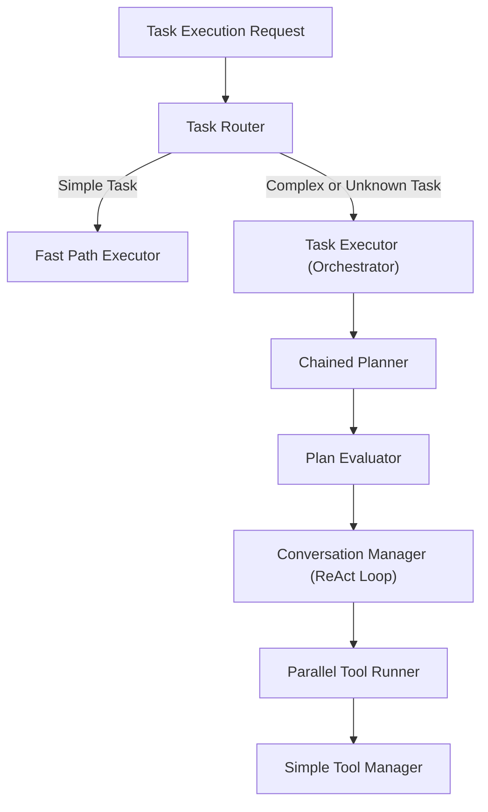
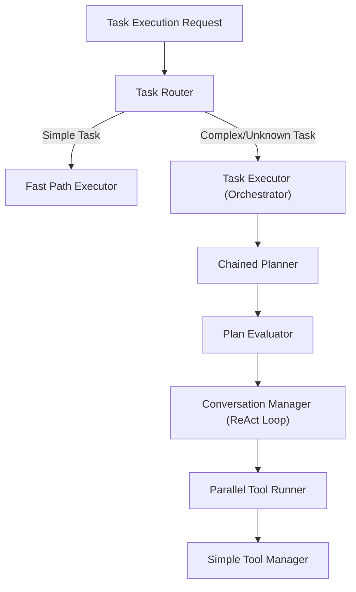

# AgentAlpha – Pattern-Driven Evolution Roadmap

## 1. Purpose
This document proposes how **AgentAlpha** can progressively adopt the agent-design patterns defined in `docs/agent-design-patterns.md`.  
Goals:

1. Increase reliability and predictability.  
2. Reduce latency & cost for straightforward tasks.  
3. Enable sophisticated behaviour only when beneficial.  
4. Keep the codebase modular, testable, and easy to reason about.

## 2. Current State (v0.x)
AgentAlpha already implements an **Autonomous Agent (ReAct)** pattern backed by:
- `PlanningService` for plan generation.
- `ConversationManager` for reasoning/action cycles.
- `SimpleToolManager` for tool discovery / execution.
- `TaskExecutor` as the high-level orchestrator.

Strengths: flexibility, rich logging, extensible tool layer.  
Weaknesses: every task incurs full ReAct overhead; lack of fine-tuned control paths for simpler jobs; no explicit evaluation loop.

## 3. Pattern-to-Component Mapping
| Pattern | Target Component(s) | Rationale |
|---------|--------------------|-----------|
| **Prompt Chaining** | `PlanningService` & new `ChainedPlanner` | Break plan creation into *Analyse → Outline → Detail* steps for higher plan quality. |
| **Routing** | new `TaskRouter` (inside `TaskExecutor`) | Quickly route “simple” tasks (e.g. single tool call) to fast path, heavy tasks to ReAct pipeline. |
| **Parallelization (Sectioning)** | new `ParallelToolRunner` | Allow independent tool calls (e.g. file-info on many files) to execute concurrently. |
| **Evaluator-Optimizer** | new `PlanEvaluator` service | Iteratively refine plans or outputs when evaluation criteria indicate deficiencies. |
| **Orchestrator-Workers** | existing `TaskExecutor` (orchestrator) + lightweight *worker* LLM calls via `ConversationManager` | Enables decomposition of complex tasks into sub-conversations executed in parallel and aggregated. |
| **Autonomous Agent (ReAct)** | `ConversationManager` + `SimpleToolManager` (status-quo) | Retained for open-ended problems requiring exploration. |

## 4. Target Architecture (v1.x)

### Key Points
1. **Router first** – cheap classification logic (few-shot prompt).  
2. **Fast path** – one-shot LLM or direct tool call when possible.  
3. **Chained planning** – three serial prompts improve plan structure before execution.  
4. **Evaluation loop** – run evaluator after each major stage; stop when success conditions are met.  
5. **Parallel tool runner** – batches independent tool invocations to cut latency.  

## 5. Implementation Plan

| Phase | Milestones | Code Changes |
|-------|------------|--------------|
| **P1 – Routing & Fast Path** | `TaskRouter`, `IFastPathExecutor` | • New interface & implementation • Update `Program` DI registration • Unit tests for routing logic |
| **P2 – Prompt Chaining Planner** | `ChainedPlanner` service | • Split `PlanningService` into analyser / outliner / detailer prompts • Retain existing service for fallback |
| **P3 – Plan Evaluation Loop** | `PlanEvaluator` + iteration policy | • Add evaluation request/response schema • Integrate into `TaskExecutor` after planning |
| **P4 – Parallel Tool Runner** | `ParallelToolRunner` | • Wrap `SimpleToolManager.ExecuteToolAsync` in `Task.WhenAll` where safe • Configurable concurrency level |
| **P5 – Worker Sub-Conversations** | Sub-conversation support in `ConversationManager` | • New method `SpawnWorkerAsync(taskSegment)` • Aggregate results via orchestrator |
| **P6 – Metrics & Roll-out** | Success metrics | • Add counters (latency, token cost, success rate) |

## 6. Risk Mitigation
- **Complexity creep**: roll back to simpler routing when needed.  
- **Cost increase**: track `Usage` tokens; abort long loops.  
- **Tool side-effects**: keep `SimpleToolManager` concurrency safe; add dry-run mode for tests.

## 7. Architecture Diagram

