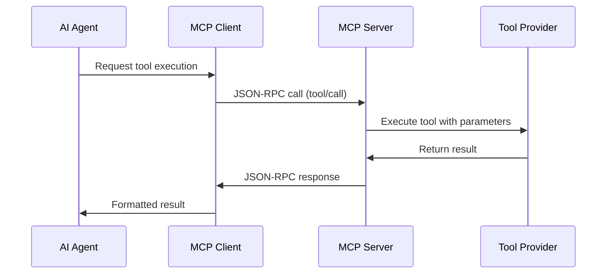
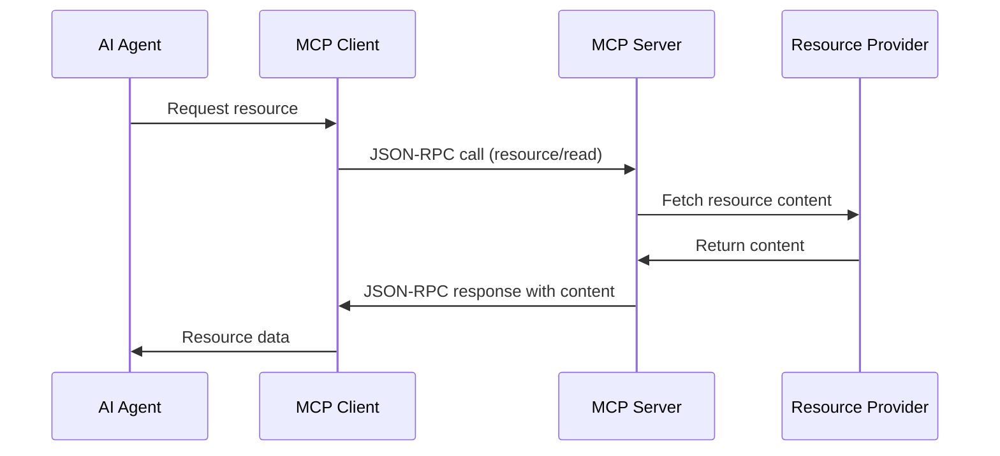

# Architecture

This document describes the overall architecture and design decisions for the Agents repository.

## High-Level Architecture

The repository is structured around the Model Context Protocol (MCP) and follows a modular, extensible design:

```
┌─────────────────────────────────────────────────────────────┐
│                    Agents Repository                        │
├─────────────────────────────────────────────────────────────┤
│  ┌─────────────┐    ┌─────────────┐    ┌─────────────┐     │
│  │ AI Agent 1  │    │ AI Agent 2  │    │ AI Agent N  │     │
│  │             │    │             │    │             │     │
│  └─────┬───────┘    └─────┬───────┘    └─────┬───────┘     │
│        │                  │                  │             │
│        └──────────────────┼──────────────────┘             │
│                           │                                │
│  ┌─────────────────────────┼─────────────────────────────┐  │
│  │         MCP Client      │                             │  │
│  │  ┌──────────────────────▼──────────────────────────┐  │  │
│  │  │        ModelContextProtocol SDK                 │  │  │
│  │  └─────────────────────────────────────────────────┘  │  │
│  └─────────────────────────┬─────────────────────────────┘  │
│                            │                                │
│    ┌───────────────────────┼───────────────────────────┐    │
│    │         MCP Protocol (JSON-RPC over stdio)        │    │
│    └───────────────────────┼───────────────────────────┘    │
│                            │                                │
│  ┌─────────────────────────┼─────────────────────────────┐  │
│  │         MCP Server      │                             │  │
│  │  ┌──────────────────────▼──────────────────────────┐  │  │
│  │  │        ModelContextProtocol SDK                 │  │  │
│  │  └─────────────────────────────────────────────────┘  │  │
│  │  ┌─────────────┐ ┌─────────────┐ ┌─────────────┐   │  │
│  │  │   Tools     │ │ Resources   │ │   Prompts   │   │  │
│  │  │ Provider    │ │ Provider    │ │  Provider   │   │  │
│  │  └─────────────┘ └─────────────┘ └─────────────┘   │  │
│  └─────────────────────────────────────────────────────┘  │
└─────────────────────────────────────────────────────────────┘
```

## Core Components

### 1. Model Context Protocol (MCP)

MCP serves as the communication protocol between AI agents and their tools/resources:

- **Standardized Interface**: Consistent API for all agent interactions
- **JSON-RPC Based**: Reliable, well-established communication protocol
- **Bidirectional**: Supports both client and server capabilities
- **Extensible**: Easy to add new tools and resources

### 2. MCP Server

The server component exposes tools and resources to MCP clients:

**Responsibilities:**
- Tool registration and management
- Resource provisioning and access control
- Request routing and execution
- Response formatting and error handling

**Architecture:**
```csharp
McpServer
├── ToolProviders/
│   ├── EchoToolProvider
│   ├── TimeToolProvider
│   └── RandomToolProvider
├── ResourceProviders/
│   ├── ConfigurationProvider
│   └── SystemInfoProvider
└── Protocol/
    ├── RequestHandler
    ├── ResponseFormatter
    └── ErrorHandler
```

### 3. MCP Client

The client component connects to MCP servers and provides access to their capabilities:

**Responsibilities:**
- Server connection management
- Tool discovery and invocation
- Resource access and caching
- User interface and interaction

**Architecture:**
```csharp
McpClient
├── ConnectionManager
├── ToolClient
├── ResourceClient
├── PromptClient
└── UserInterface/
    ├── CommandLineInterface
    └── (Future) GraphicalInterface
```

### 4. Shared Libraries

Common functionality shared between components:

**Current Structure:**
```
Shared/
├── Models/
│   ├── ToolDefinition
│   ├── ResourceDefinition
│   └── PromptDefinition
├── Extensions/
│   ├── LoggingExtensions
│   └── ConfigurationExtensions
└── Utilities/
    ├── JsonHelper
    └── ValidationHelper
```

## Design Principles

### 1. Modularity

Each component is self-contained and loosely coupled:
- **Separation of Concerns**: Clear boundaries between components
- **Interface-Based Design**: Contracts define component interactions
- **Dependency Injection**: Configurable component composition

### 2. Extensibility

The architecture supports easy extension:
- **Plugin Architecture**: New tools and resources can be added dynamically
- **Provider Pattern**: Standardized interfaces for capability providers
- **Configuration-Driven**: Behavior modification without code changes

### 3. Reliability

Built for production use:
- **Error Handling**: Comprehensive error management and recovery
- **Logging**: Detailed logging for debugging and monitoring
- **Testing**: Unit and integration tests for all components

### 4. Performance

Optimized for efficiency:
- **Async/Await**: Non-blocking operations throughout
- **Resource Pooling**: Efficient resource management
- **Caching**: Smart caching of frequently accessed data

## Communication Flow

### Tool Invocation Flow



### Resource Access Flow



## Technology Stack

### Framework and Runtime
- **.NET 8.0**: Modern, cross-platform runtime
- **C# 12**: Latest language features and syntax
- **Microsoft.Extensions**: Dependency injection, logging, configuration

### MCP Implementation
- **ModelContextProtocol NuGet Package**: Official C# SDK (see also `reference/csharp-sdk` for full source)
- **JSON-RPC**: Standard protocol implementation
- **Stdio Transport**: Simple, reliable communication

### Development Tools
- **Visual Studio / VS Code**: Primary development environments
- **MSBuild**: Build system and project management
- **NuGet**: Package management

## Deployment Patterns

### Development Deployment
```
Developer Machine
├── MCP Server (Console App)
├── MCP Client (Console App)
└── Shared Libraries (Class Libraries)
```

### Production Deployment
```
Server Environment
├── MCP Server (Windows Service / systemd)
├── Configuration Files
├── Logging Infrastructure
└── Monitoring Dashboard

Client Environment
├── MCP Client (Console/Desktop App)
├── Connection Configuration
└── Local Cache
```

## Security Considerations

### Current Security Model
- **Local Communication**: Server and client run on same machine
- **No Authentication**: Trust-based local communication
- **Input Validation**: Basic parameter validation

### Future Security Enhancements
- **Authentication**: Token-based authentication for remote connections
- **Authorization**: Role-based access control for tools and resources
- **Encryption**: TLS encryption for network communication
- **Auditing**: Comprehensive audit logging

## Scalability Considerations

### Current Limitations
- **Single Server**: One server instance per deployment
- **Local Only**: No network communication support
- **No Load Balancing**: Direct client-server communication

### Future Scalability Features
- **Multi-Server**: Support for multiple server instances
- **Load Balancing**: Distribute requests across servers
- **Clustering**: Coordinated server clusters
- **Horizontal Scaling**: Add capacity by adding servers

## Extension Points

### Adding New Tools
1. Implement `IToolProvider` interface
2. Register with dependency injection container
3. Configure in server startup

### Adding New Resources
1. Implement `IResourceProvider` interface
2. Define resource schemas
3. Register with server

### Adding New Transports
1. Implement `ITransport` interface
2. Handle protocol-specific communication
3. Register transport with client/server

## Future Architecture Evolution

### Phase 1: Enhanced MCP Implementation
- Complete MCP protocol implementation
- Full tool and resource providers
- Advanced error handling

### Phase 2: Multi-Agent Support
- Multiple concurrent agents
- Agent coordination mechanisms
- Shared resource management

### Phase 3: Distributed Architecture
- Network-based communication
- Microservices architecture
- Cloud deployment support

### Phase 4: AI-Native Features
- LLM integration for tool selection
- Autonomous agent behavior
- Learning and adaptation capabilities